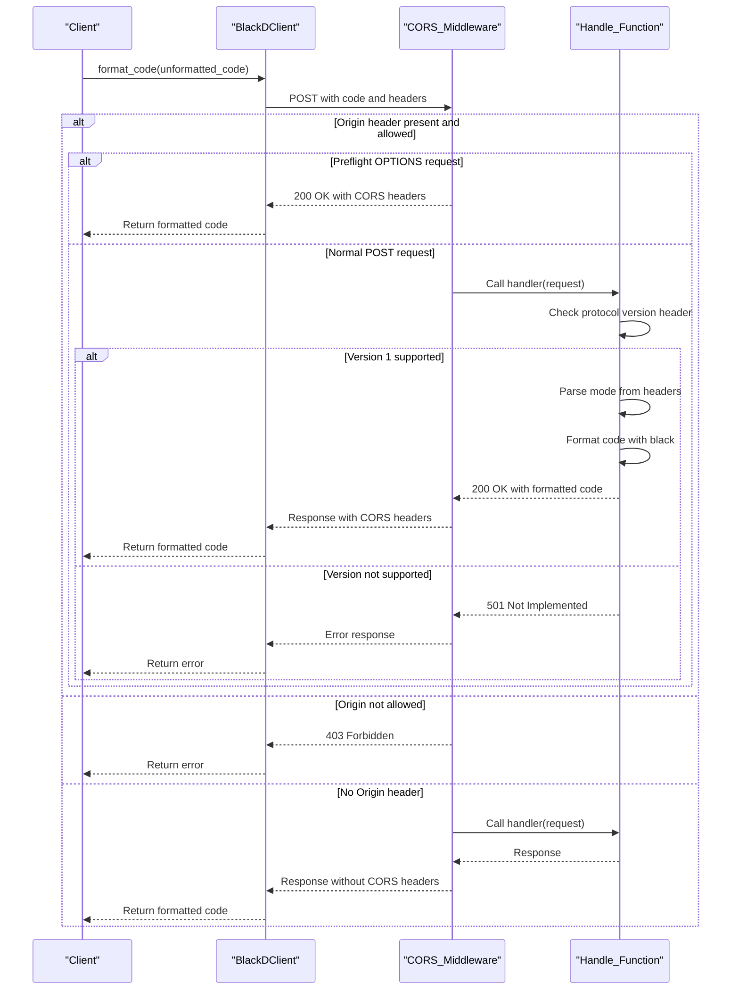

# Blackd HTTP API Conceptual Guide

> The HTTP formatting server for Black — send code, get formatted code back.


Blackd (`blackd`) is an HTTP server that exposes Black's Python code formatting capabilities over the network. It allows you to send Python source code via HTTP requests and receive properly formatted output, making it ideal for integrating Black into web services, CI pipelines, and editor plugins without shelling out to a subprocess. The server is built on [aiohttp](https://docs.aiohttp.org/) and includes CORS support for browser-based clients.

---

## Overview

Blackd lives in the `src/blackd/` package and consists of four core modules:

| Module | Purpose |
|---|---|
| `src/blackd/__init__.py` | Server initialization, HTTP headers, and route definitions |
| `src/blackd/__main__.py` | CLI entry point for launching the server |
| `src/blackd/client.py` | `BlackDClient` class for programmatic HTTP communication |
| `src/blackd/middlewares.py` | CORS middleware for aiohttp applications |

The server accepts Python source code as POST request bodies and returns formatted output. It supports configuration through HTTP headers that mirror Black's command-line options (such as target Python version and line length), enabling fine-grained control over formatting behavior per request.

### Key Classes

- **`BlackDClient`** (`src/blackd/client.py`) — A client class for interacting with the blackd HTTP formatting server. Provides a convenient interface for sending formatting requests and receiving results.

- **`HeaderError`** (`src/blackd/__init__.py`) — Represents errors related to HTTP headers in the blackd server, raised when request headers are malformed or missing required values.

- **`InvalidVariantHeader`** (`src/blackd/__init__.py`) — A specific header error raised when an invalid Python variant header is provided in a formatting request.

### Architecture

The server follows a straightforward request/response pattern: the client sends Python source code in the request body, the server parses and formats it using Black's core formatting engine, and returns the formatted result.



---

## API Reference

Blackd exposes HTTP routes for code formatting. The server is initialized in `src/blackd/__init__.py`, which defines the HTTP headers and route handlers.

> **Note:** The specific route paths and handler signatures are defined in `src/blackd/__init__.py`. Consult the source code for the complete list of supported endpoints and their exact parameter specifications.

### Formatting Endpoint

Blackd provides a primary formatting endpoint that accepts Python source code and returns formatted output. The server supports configuration via HTTP headers, allowing clients to specify formatting options such as target Python versions and line length without modifying the source code itself.

**Supported Configuration Headers:**

The server processes Python variant headers to determine formatting behavior. Invalid variant values will raise an `InvalidVariantHeader` error. General header-related issues raise a `HeaderError`.

### CORS Support

Blackd includes built-in CORS (Cross-Origin Resource Sharing) middleware via `src/blackd/middlewares.py`, enabling browser-based clients and web applications to communicate with the server across different origins.

---

## Usage

### Starting the Server

Blackd can be launched as a standalone process using its CLI entry point:

```bash
python -m blackd
```

This starts the aiohttp-based HTTP server, ready to accept formatting requests.

### Using the Python Client

The `BlackDClient` class provides a convenient way to interact with a running blackd server programmatically:

```python
from blackd.client import BlackDClient

client = BlackDClient("http://localhost:8123")

# Format Python source code
source = """
x  =  1
y   =    2
z    =     3
"""
formatted = client.format_source(source)
print(formatted)
```

### Making Direct HTTP Requests

You can also interact with blackd using any HTTP client. Send Python source code as the request body:

```python
import requests

source = """
def hello(   name,str  ):
    return "Hello, "+name
"""

response = requests.post(
    "http://localhost:8123",
    data=source.encode("utf-8"),
    headers={"Content-Type": "text/x-python; charset=utf-8"},
)

if response.status_code == 200:
    print(response.text)
else:
    print(f"Formatting failed: {response.status_code}")
```

### Configuring Formatting via Headers

Blackd accepts HTTP headers that correspond to Black's formatting options, letting you customize output per request:

```python
import requests

source = "x = [1,2,3,4,5,6,7,8,9,10,11,12,13,14,15,16,17,18,19,20]"

# Set target Python version and line length via headers
headers = {
    "Content-Type": "text/x-python; charset=utf-8",
    "X-Target-Version": "py310",
    "X-Line-Length": "88",
}

response = requests.post(
    "http://localhost:8123",
    data=source.encode("utf-8"),
    headers=headers,
)
print(response.text)
```

If an invalid Python variant header is sent, the server will return an error indicating the header value is not recognized.

---

## Error Handling

Blackd defines specific error types for common failure scenarios:

| Error Class | When It Occurs |
|---|---|
| `HeaderError` | Request headers are malformed or contain invalid values |
| `InvalidVariantHeader` | The Python version variant header specifies an unsupported version |

These errors are raised during request processing and result in appropriate HTTP error responses to the client.

---

## Integration Patterns

Blackd is designed for integration into larger workflows. Here are common patterns:

- **Editor plugins** — Editors can send unsaved buffer content to blackd for real-time formatting feedback.
- **CI/CD pipelines** — Formatting checks can be performed via HTTP rather than subprocess calls, useful in containerized environments.
- **Web applications** — Browser-based code editors can use the CORS-enabled server for formatting without same-origin restrictions.
- **Pre-commit hooks** — Scripts can delegate formatting to a running blackd instance for faster repeated formatting.

For command-line usage of the `black` formatter itself (which blackd wraps over HTTP), see the [CLI Reference](CLI.md). For the broader system architecture, see [Architecture](ARCHITECTURE.md).

---

## Further Reading

- [CLI Reference](CLI.md) — Complete reference for Black's command-line options
- [Architecture](ARCHITECTURE.md) — System-wide architecture and component relationships
- [Development Setup](DEVELOPMENT.md) — How to set up a development environment and run blackd locally
- [Testing Guide](TESTING.md) — How to run and write tests for blackd
- [Contribution Guidelines](CONTRIBUTING.md) — How to contribute to the project