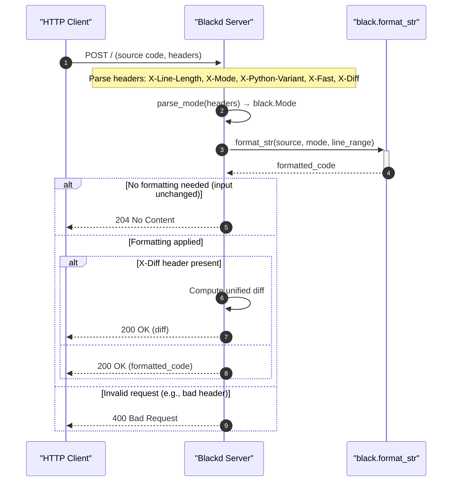

# Blackd HTTP API Conceptual Guide

> A lightning-fast HTTP API for formatting Python code with Black.


Blackd is the HTTP API server for the Black code formatter. It exposes Black's formatting engine over HTTP, allowing editors, CI systems, and other tools to format Python code without invoking the CLI. Built on `aiohttp`, blackd handles concurrent requests asynchronously, making it ideal for editor integrations and bulk formatting pipelines.

**Key highlights:**
- Asynchronous, non-blocking request handling via `aiohttp`
- Supports protocol version negotiation, fast/safe modes, and Python target version selection
- Includes built-in CORS middleware for cross-origin requests from web-based tools
- Comes with a reference client (`BlackDClient`) for easy integration
- Provides diff-only responses for integration with diff-based workflows

---

## API Reference

The blackd API exposes a single POST endpoint for formatting Python source code. Configuration is passed via HTTP headers, and the response contains either the formatted code, a diff, or an appropriate error status.

### `POST /`

Handler: `handle` — Processes incoming HTTP requests to format Python source code via the blackd server.

**Request:** The source code is sent as the request body. Formatting options are specified through custom HTTP headers. The charset is inferred from the request's `Content-Type` header, defaulting to UTF-8.

**Response headers:** All responses include the `X-Black-Version` header with the current Black version.

**Response status codes:**

| Status | Meaning |
|--------|---------|
| `204 No Content` | Returned when formatting produces no changes (`black.NothingChanged`). The source is already Black-compliant. |
| `400 Bad Request` | Invalid input — malformed Python source or invalid header values. Body contains error text. |
| `501 Not Implemented` | Unsupported protocol version (`X-Protocol-Version` other than `"1"`). |
| `500 Internal Server Error` | Unexpected server-side exception. Body contains error text. |
| `200 OK` | Formatted code (or diff) is returned in the response body. |

**Request headers:**

| Header | Values | Default | Description |
|--------|--------|---------|-------------|
| `X-Protocol-Version` | `"1"` | `"1"` | Protocol version for future compatibility. |
| `X-Fast-Or-Safe` | `"fast"` or `"safe"` | `"safe"` | When `"fast"`, skips AST safety checks. When `"safe"`, verifies output is AST-equivalent to input. |
| `X-Python-Variant` | Comma-separated values like `py38,py39` or `pyi` | — | Target Python versions or `pyi` for stub files. |
| `X-Diff` | Any truthy value | Not set | When present, returns a unified diff instead of the full formatted code. |
| `X-Skip-Source-First-Line` | Any truthy value | Not set | Preserves the first line of source (e.g., a shebang) outside of formatting. |
| `X-Mode` | Hex-encoded mode integer | — | Raw `Mode` bitmask for advanced configuration. |

**Example request:**

```http
POST / HTTP/1.1
Content-Type: text/plain; charset=utf-8
X-Python-Variant: py310

x =       42
```

**Example response (204 No Content):**

```http
HTTP/1.1 204 No Content
X-Black-Version: 24.1.0
```

**Example response (200 OK with diff):**

```http
HTTP/1.1 200 OK
Content-Type: text/plain; charset=utf-8
X-Black-Version: 24.1.0

--- original
+++ formatted
@@ -1 +1 @@
-x =       42
+x = 42
```

**Errors:**

The handler catches and returns appropriate statuses for the following exception types:

- `black.NothingChanged` → `204`
- `black.InvalidInput` → `400`
- `black.SourceASTParseError` → `400`
- `HeaderError` (invalid header values) → `400`
- Unhandled exceptions → `500`

---

## Usage

### Starting the blackd server

Blackd is started via the `blackd` command, which is installed alongside Black.

```bash
# Start with default settings (binds to localhost:45484)
blackd

# Bind to a specific host and port
blackd --bind-host 0.0.0.0 --bind-port 9090
```

### Formatting code with curl

The quickest way to test blackd is with `curl`:

```bash
# Basic formatting
echo "x =       42" | curl -s -X POST --data-binary @- http://localhost:45484/
# Output: x = 42

# With Python 3.10 target and diff output
echo "x =       42" | curl -s -X POST \
  -H "X-Python-Variant: py310" \
  -H "X-Diff: true" \
  --data-binary @- \
  http://localhost:45484/
```

### Using the Python client (`BlackDClient`)

Black ships with a reference client in `src/blackd/client.py`. Here's how to use it:

```python
from blackd.client import BlackDClient

client = BlackDClient()

# Format a snippet — returns formatted string
formatted = await client.format("x =       42")
print(formatted)  # "x = 42\n"

# Format with Python 3.10 target and get a diff
diff = await client.format(
    "x =       42",
    python_variant="py310",
    diff=True,
)
print(diff)
```

### Integrating with an editor

Blackd's CORS middleware makes it easy to use from web-based editors or browser extensions. Here's a minimal JavaScript example:

```javascript
const response = await fetch("http://localhost:45484/", {
  method: "POST",
  headers: {
    "Content-Type": "text/plain; charset=utf-8",
    "X-Python-Variant": "py311",
  },
  body: "x =       42",
});

if (response.status === 200) {
  const formatted = await response.text();
  console.log(formatted); // "x = 42\n"
} else if (response.status === 204) {
  console.log("Already formatted");
} else {
  console.error("Error:", await response.text());
}
```

### Getting a diff without modifying the file

Use the `X-Diff` header to see what Black would change without applying formatting:

```bash
cat my_code.py | curl -s -X POST \
  -H "X-Diff: true" \
  --data-binary @- \
  http://localhost:45484/
```

This returns a unified diff output, letting you preview changes before accepting them.

---

## Architecture

The blackd module is organized around three key components:

- **`src/blackd/__init__.py`** — Defines the server entry point, the `handle` async request handler, header parsing utilities, and error classes (`HeaderError`, `InvalidVariantHeader`).
- **`src/blackd/__main__.py`** — The command-line entry point that launches the server.
- **`src/blackd/client.py`** — Provides `BlackDClient`, an async HTTP client for interacting with blackd programmatically.
- **`src/blackd/middlewares.py`** — CORS middleware factory for aiohttp, allowing cross-origin requests from web clients.



The request flow is:

1. **CORS middleware** intercepts incoming requests, adding appropriate `Access-Control-*` headers.
2. **`handle`** validates the protocol version, parses formatting headers, and reads the request body.
3. **`parse_mode`** (via helper functions like `parse_python_variant_header`) constructs a `black.Mode` from the request headers.
4. **`format_code`** runs the Black formatter asynchronously, respecting `fast`/`safe` and `only_diff` options.
5. The response is returned with the formatted code (or diff, or `204`).

---

## Configuration and Tuning

Blackd respects all `black.Mode` configuration options through its header-based interface. Key tuning parameters:

- **Thread pool execution**: Formatting is offloaded to a thread pool executor (`concurrent.futures.Executor`) with a bounded semaphore to limit concurrent formatting operations. This keeps the event loop responsive.
- **Protocol versioning**: Clients must send `X-Protocol-Version: 1` (the only supported version). This allows future protocol evolution.
- **`skip_source_first_line`**: Useful when formatting code that has a shebang or encoding declaration — blackd preserves the first line untouched.

---

## Related Documentation

- [Command-Line Interface Reference](CLI.md) — For CLI-based formatting with Black.
- [Development Setup and Workflow](DEVELOPMENT.md) — How to set up the project for local development, including running blackd in development mode.
- [Testing Guide](TESTING.md) — Covers integration tests for the blackd server.