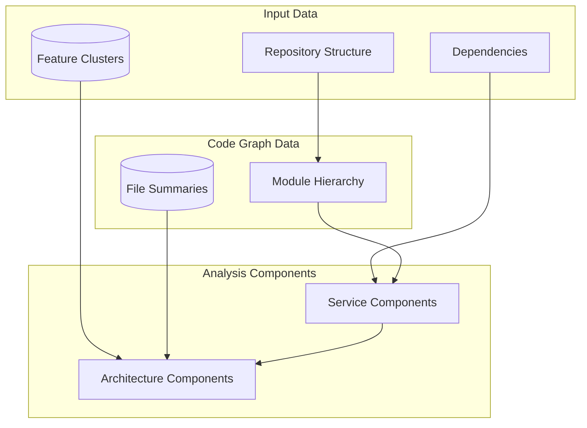
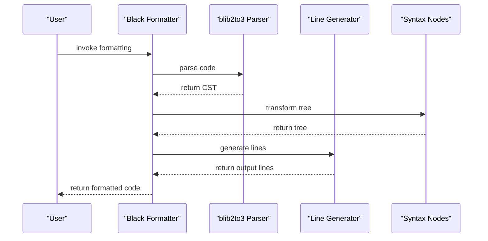
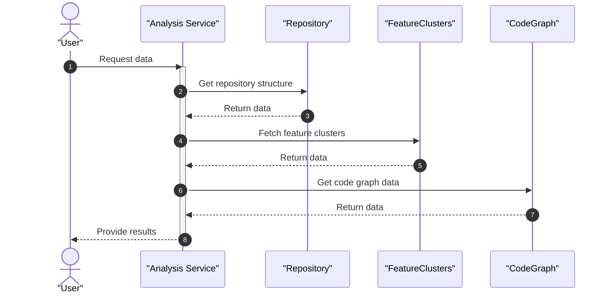
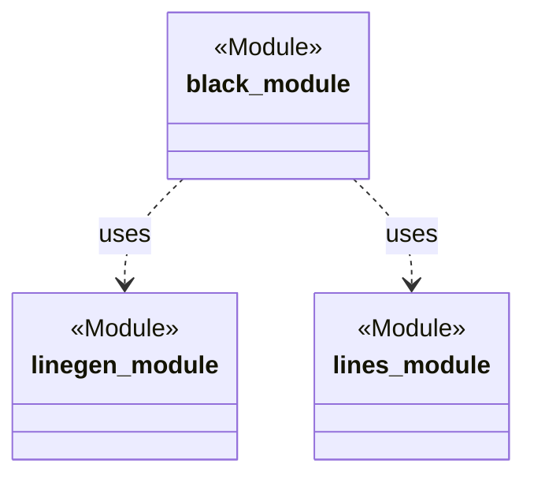
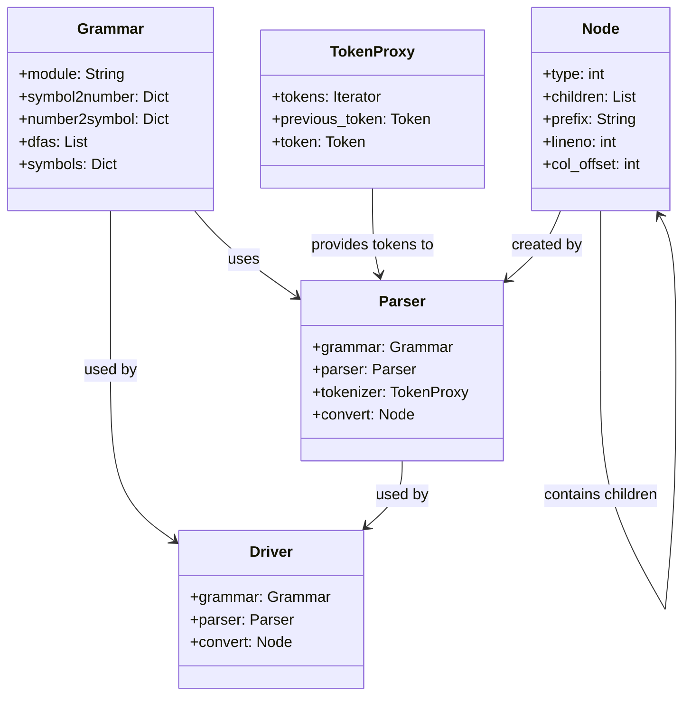
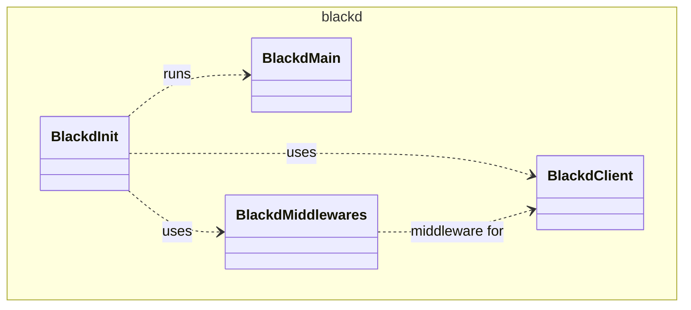

# System Architecture

The internal design and component structure of Black, the Python code formatter.

Black is a deterministic Python code formatter that parses source code into a concrete syntax tree, applies a comprehensive set of formatting rules, and produces consistently styled output. The architecture is organized into three primary packages: the core formatting engine (`black`), an HTTP formatting server (`blackd`), and a forked parser (`blib2to3`). This document describes the system-level design, component responsibilities, and how these pieces interact to produce formatted code.

---

## Architecture

The system follows a pipeline architecture where source code flows through parsing, transformation, and output stages. A central `Mode` configuration object controls formatting behavior across the entire pipeline.

### Core Formatting Pipeline

The primary formatting pipeline processes Python source code through these stages:

1. **Parsing** — Source code is tokenized and parsed into a concrete syntax tree (CST) by `blib2to3`, a fork of Python's `lib2to3` parser. The parser uses a grammar defined in `pygram.py` and a parser engine in `pgen2/parse.py`.
2. **AST Safety Check** — After formatting, the output is validated against a standard `ast.parse()` to ensure semantic equivalence (`InvalidInput`, `ASTSafetyError` in `parsing.py`).
3. **Line Generation** — The CST is walked by `LineGenerator` (`linegen.py`), which produces `Line` objects representing individual output lines. This stage handles bracket splitting, indentation, and construct-specific formatting rules.
4. **String Transformation** — Long strings are split, merged, and reformatted by a hierarchy of `StringTransformer` classes in `trans.py`.
5. **Empty Line Tracking** — `EmptyLineTracker` (`lines.py`) manages blank line insertion between code blocks based on context.
6. **Output** — Formatted lines are serialized back to source text, optionally producing diffs.

### Component Interaction Summary

The `Mode` dataclass (`mode.py`) is passed through the pipeline and governs target Python versions, line length, and preview features. `BracketTracker` (`brackets.py`) maintains delimiter priority and depth during line splitting. `comments.py` handles formatting directives like `# fmt: off` and `# fmt: on` by normalizing comments in the syntax tree. For Jupyter notebooks, `handle_ipynb_magics.py` masks IPython magic commands before formatting and restores them afterward.

The `blackd` package provides an HTTP server (built on aiohttp) that exposes the same formatting logic over HTTP, with CORS support via `middlewares.py`.













### Key Design Decisions

- **Forked Parser** — Black uses `blib2to3`, a fork of Python's `lib2to3`, rather than the standard `ast` module. This provides access to concrete syntax details (whitespace, comments, parentheses) that the standard AST discards.
- **Deterministic Formatting** — All formatting decisions are based solely on the source code and the `Mode` configuration, ensuring idempotent output.
- **Preview Mode** — The `Preview` enum (`mode.py`) gates individual formatting features that are still under development, allowing incremental rollout of style changes.
- **Rust-inspired Result Types** — The `rusty.py` module provides `Ok` and `Err` classes for explicit error handling without exceptions in certain code paths.

---

## Structure

```
src/
├── black/                    # Core formatting engine
│   ├── __init__.py           # CLI entry point and main formatting functions
│   ├── __main__.py           # Module entry point wrapper
│   ├── mode.py               # Mode, TargetVersion, Feature, Preview enums
│   ├── parsing.py            # Source parsing and AST safety validation
│   ├── linegen.py            # Line generation from syntax trees
│   ├── lines.py              # Line, LinesBlock, EmptyLineTracker, RHSResult
│   ├── brackets.py           # BracketTracker and delimiter priority logic
│   ├── comments.py           # Comment normalization and fmt:off handling
│   ├── trans.py              # String transformers (split, merge, strip)
│   ├── strings.py            # String manipulation utilities
│   ├── nodes.py              # Syntax tree traversal and transformation utilities
│   ├── ranges.py             # Line range formatting support
│   ├── handle_ipynb_magics.py # IPython magic masking for Jupyter notebooks
│   ├── concurrency.py        # Parallel file formatting utilities
│   ├── cache.py              # File system cache (Cache, FileData)
│   ├── files.py              # File discovery and pyproject.toml parsing
│   ├── numerics.py           # Numeric literal formatting
│   ├── output.py             # Diff generation and styled terminal output
│   ├── report.py             # Formatting statistics (Report, Changed, NothingChanged)
│   ├── rusty.py              # Result types (Ok, Err)
│   ├── schema.py             # JSON schema for configuration validation
│   ├── debug.py              # DebugVisitor for syntax tree inspection
│   ├── const.py              # Default configuration constants
│   ├── _width_table.py       # Unicode character width calculations
│   └── resources/            # Package resources
├── blackd/                   # HTTP formatting server
│   ├── __init__.py           # Server entry point and request handling
│   ├── __main__.py           # CLI entry point for blackd
│   ├── client.py             # BlackDClient HTTP client
│   └── middlewares.py        # CORS middleware for aiohttp
└── blib2to3/                 # Forked parser (lib2to3 derivative)
    ├── pytree.py             # Syntax tree node structures (Leaf, Node)
    ├── pygram.py             # Python grammar and symbol exports
    └── pgen2/                # Parser generator engine
        ├── driver.py         # High-level parsing interface
        ├── parse.py          # Parser engine (grammar-based)
        ├── grammar.py        # Grammar data structures
        ├── tokenize.py       # Python source tokenizer
        ├── token.py          # Token constants
        ├── pgen.py           # Parser table generator
        ├── literals.py       # String literal evaluation utilities
        └── conv.py           # C grammar to Python conversion
```

### Package Responsibilities

| Package | Purpose |
|---------|---------|
| `black` | Core formatting engine: parsing, line generation, string transformation, output |
| `blackd` | HTTP server exposing formatting as a service, with CORS and a client library |
| `blib2to3` | Forked Python parser providing concrete syntax tree access |

### Supporting Directories

| Directory | Purpose |
|-----------|---------|
| `tests/data/cases/` | Formatting test fixtures (input/output pairs for edge cases) |
| `scripts/` | Release automation, schema generation, fuzzing, and CI helpers |
| `action/` | GitHub Action entrypoint for running Black in CI workflows |
| `docs/` | Sphinx documentation configuration |
| `profiling/` | Performance profiling data |