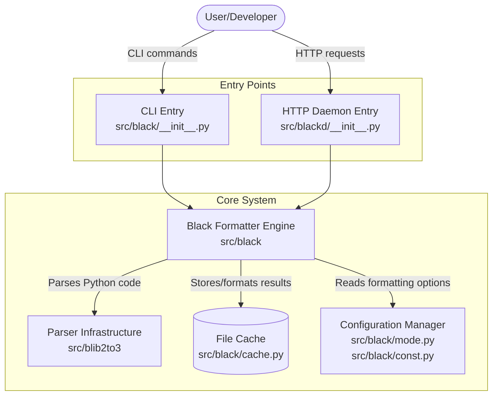
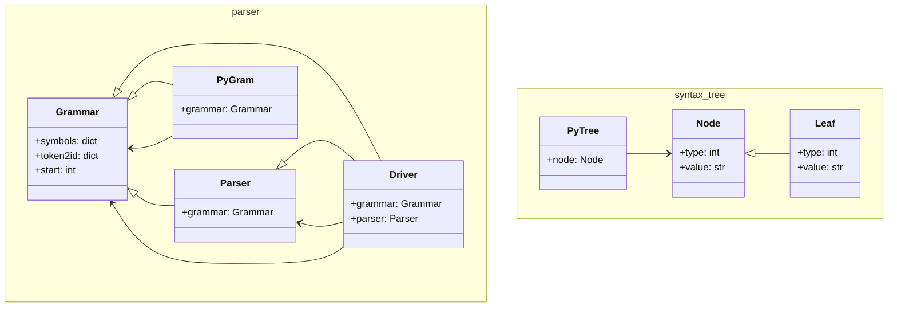
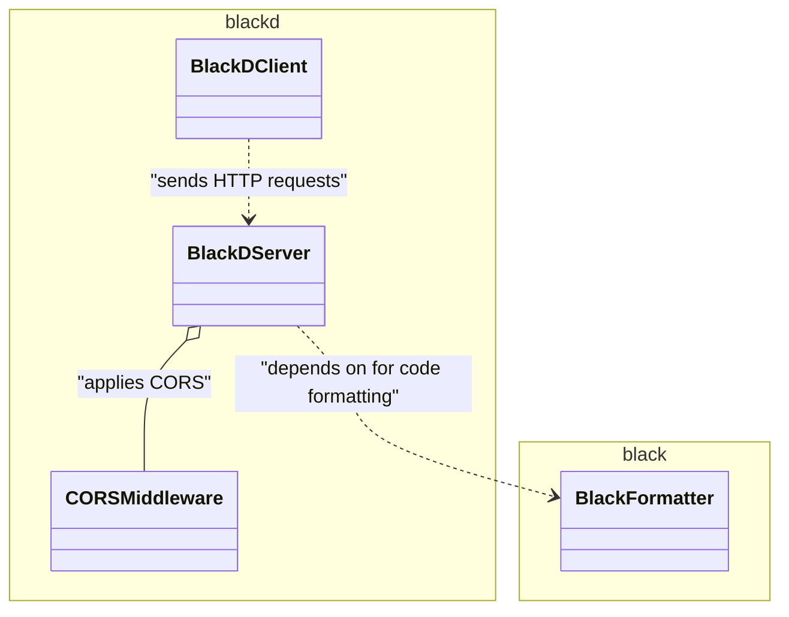
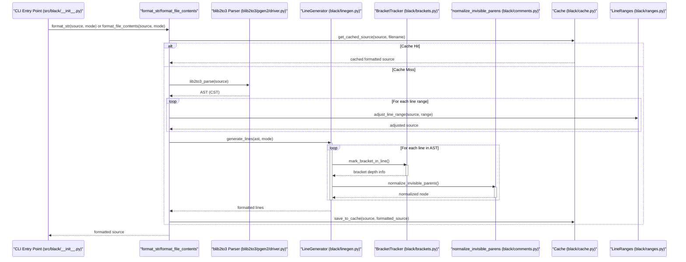
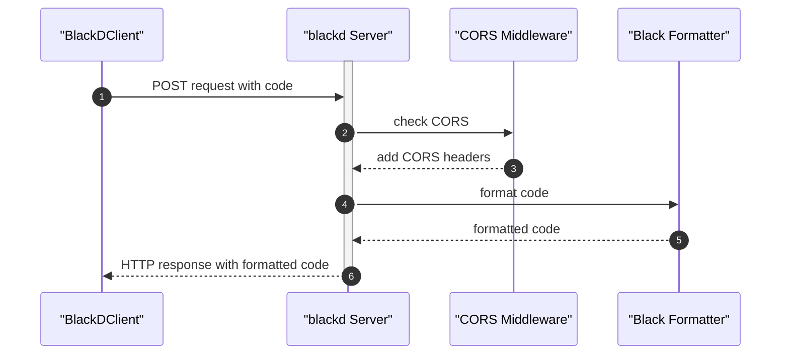
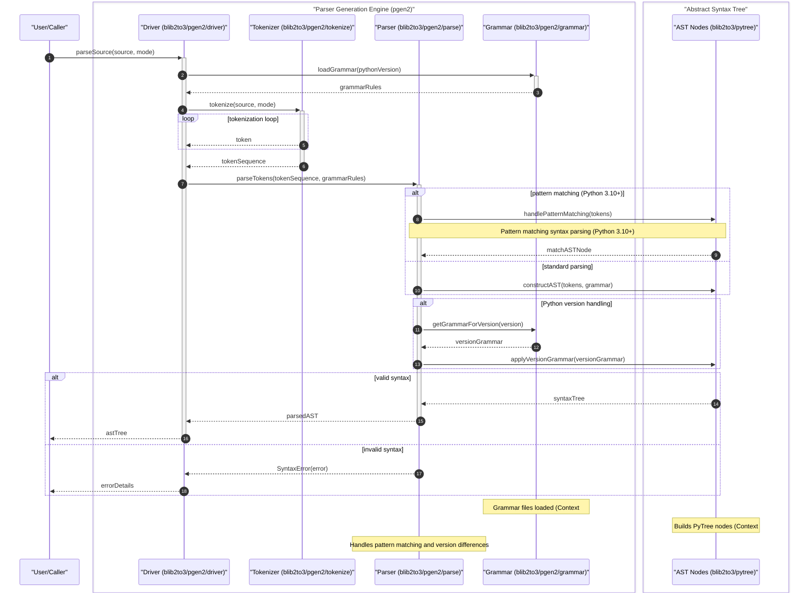

# System Architecture

Black is an opinionated Python code formatter that parses source code into a concrete syntax tree and reformats it according to deterministic rules. The architecture is organized into three primary subsystems: the core formatting engine (`src/black`), the HTTP daemon and client (`src/blackd`), and a vendored parser infrastructure (`src/blib2to3`).



## Architecture

Black's design follows a pipeline-oriented architecture where source code flows through parsing, concrete syntax tree transformation, line generation, and output stages. The system enforces a single canonical style by design—there are no formatting configuration knobs that alter style decisions.

### Core Formatting Engine

The core engine in `src/black/` is responsible for all formatting logic. It operates on a lib2to3-derived concrete syntax tree (CST), preserving comments and whitespace information that pure ASTs discard.

```mermaid
classDiagram
    %% Core formatting engine classes - Source: context #1 (file list) and context #2 (cluster summaries)
    %% Based on repository structure and cluster descriptions

    namespace formatting_pipeline {
        %% Main formatting pipeline classes
        class LineGenerator {
            %% Source: context #1 - linegen.py
            %% Context #2: "line generation and manipulation (Cluster_5)"
            +generate_lines()$ : List
        }

        class Line {
            %% Source: context #1 - lines.py
            %% Context #2: "line generation and manipulation (Cluster_5)"
            +content: str
            +is_comment: bool
            +indent_level: int
        }

        class BracketTracker {
            %% Source: context #1 - brackets.py
            %% Context #2: "bracket tracking and comment parsing"
            +track_bracket_depth()
            +is_formatting_off()$ : bool
        }

        class Comment {
            %% Source: context #1 - comments.py
            %% Context #2: "bracket tracking and comment parsing"
            +content: str
            +is_inline: bool
        }
    }

    namespace transformation_engine {
        %% Syntax tree manipulation and string transformation
        class StringTransformer {
            %% Source: context #1 - trans.py
            %% Context #2: "syntax tree manipulation and string transformation utilities"
            +transform()$ : str
        }

        class Node {
            %% Source: context #1 - nodes.py
            %% Context #2: "syntax tree manipulation"
            +children: List
            +type: str
        }

        class StringUtilities {
            %% Source: context #1 - strings.py
            %% Context #2: "string transformation utilities"
            +normalize()
            +split_string()$ : List
        }
    }

    namespace configuration_management {
        %% Configuration management for Python versions
        class Mode {
            %% Source: context #1 - mode.py
            %% Context #2: "configuration management for Python versions"
            +python_version: str
            +target_versions: Set
        }

        class Config {
            %% Source: context #1 - __init__.py (implied)
            %% Context #2: configuration management
            +target_versions: Set
            +line_length: int
            +is_pyi: bool
        }
    }

    namespace parsing_utilities {
        %% Parsing utilities for syntax trees
        class Parser {
            %% Source: context #1 - parsing.py
            %% Context #2: syntax tree manipulation
            +parse()$ : Node
        }

        class RangeManager {
            %% Source: context #1 - ranges.py
            %% Context #2: "line range parsing and adjustment"
            +find_leaf_nodes()
            +parse_line_ranges()
        }
    }

    %% Relationships (placed OUTSIDE all namespace blocks)
    LineGenerator --> Line : generates
    LineGenerator --> BracketTracker : uses
    LineGenerator --> Comment : parses
    LineGenerator --> StringTransformer : transforms

    StringTransformer --> Node : modifies
    StringTransformer --> StringUtilities : uses

    Config --> Mode : configures
    LineGenerator --> Config : reads

    Parser --> Node : produces
    RangeManager --> Node : operates_on
    BracketTracker --> Node : tracks
```



Key components:

- **`mode.py`** — Defines configuration via the `Mode` class, including `TargetVersion` (supported Python versions), `Feature` (language features), and `Preview` (experimental formatting behaviors). All formatting decisions reference these settings.
- **`linegen.py`** — The `LineGenerator` traverses the syntax tree and produces `Line` objects. It handles all Python constructs (functions, classes, context managers, pattern matching, etc.) and applies formatting rules including bracket splitting via `_BracketSplitComponent`.
- **`lines.py`** — Contains `Line` (represents a single output line with leaves and comments), `RHSResult` (right-hand side split results), `LinesBlock` (tracks empty line requirements between blocks), and `EmptyLineTracker` (stateful empty-line calculation).
- **`brackets.py`** — The `BracketTracker` monitors bracket depth and delimiter priorities to inform line-splitting decisions. It raises `BracketMatchError` on malformed bracket sequences.
- **`trans.py`** — A hierarchy of `StringTransformer` subclasses that handle string splitting, merging, and parenthesization. Includes `StringMerger`, `StringSplitter`, `StringParenStripper`, and the `CustomSplitMapMixin` for custom split-point management.
- **`comments.py`** — Parses and normalizes comments in the syntax tree, representing them as `ProtoComment` instances with type, value, whitespace, and newline metadata.
- **`nodes.py`** — Provides the `Visitor` base class and utilities for traversing and transforming lib2to3 syntax tree nodes.
- **`ranges.py`** — Handles partial formatting of specific line ranges via `_TopLevelStatementsVisitor` and `_LinesMapping`.

Supporting modules:

- **`parsing.py`** — Parses Python source into CSTs and validates AST safety with `ASTSafetyError` and `InvalidInput` exceptions.
- **`files.py`** — Manages file discovery, project root detection, and `pyproject.toml` configuration parsing.
- **`cache.py`** — `Cache` and `FileData` avoid reformatting unchanged files by tracking file metadata.
- **`concurrency.py`** — Parallel file formatting via multiprocessing.
- **`output.py`** — Terminal styled output, diff generation, and file write-back via the `WriteBack` enum.
- **`report.py`** — `Report` tracks reformatting statistics; `Changed` enum and `NothingChanged` exception model file change state.
- **`rusty.py`** — Rust-inspired `Ok`/`Err` result types for error handling throughout the engine.
- **`numerics.py`** — Normalizes numeric literals (hex, octal, scientific notation, complex numbers).
- **`strings.py`** — Low-level string manipulation utilities.

### Parser Infrastructure

Black uses a vendored fork of lib2to3 (`src/blib2to3/`) for parsing Python source code into concrete syntax trees.



- **`pgen2/driver.py`** — High-level interface that drives parsing of source files into syntax trees.
- **`pgen2/parse.py`** — The parser engine, implementing grammar-table-driven parsing based on Python's original `parser.c`.
- **`pgen2/grammar.py`** — Grammar data structures and operator mappings consumed by the parser.
- **`pgen2/token.py`** and **`pgen2/tokenize.py`** — Token constants and the tokenizer that converts source text into a token stream.
- **`pgen2/literals.py`** — Safely evaluates Python string literals without using `eval()`.
- **`pytree.py`** — Defines CST node and leaf structures, including pattern matching for tree traversal.
- **`pygram.py`** — Exports the Python grammar and symbols, initializing them on demand.

### HTTP Daemon (blackd)

`src/blackd/` provides an HTTP server for formatting code remotely and a Python client for interacting with it.



- **`src/blackd/__init__.py`** — The aiohttp-based HTTP server. Handles formatting requests with configuration passed via HTTP headers. Defines `HeaderError` and `InvalidVariantHeader` for input validation.
- **`src/blackd/client.py`** — The `BlackDClient` class for programmatic interaction with a running blackd instance.
- **`src/blackd/middlewares.py`** — CORS middleware for cross-origin requests to the formatting server.
- **`src/blackd/__main__.py`** — CLI entry point for launching the blackd server.

### Data Flow

The formatting pipeline transforms source code through a series of well-defined stages:



1. **File discovery** — `files.py` locates Python source files, respecting project configuration and ignore patterns.
2. **Parsing** — `parsing.py` and `blib2to3` convert source text into a concrete syntax tree.
3. **Magic handling** — For Jupyter notebooks, `handle_ipynb_magics.py` masks IPython magic commands before formatting and restores them afterward.
4. **Line generation** — `linegen.py` walks the CST and produces `Line` objects, applying formatting rules including bracket-aware splitting.
5. **String transformation** — `trans.py` applies string transformers (merging, splitting, parenthesization) to fit long strings within line length limits.
6. **Empty line tracking** — `lines.py` calculates required blank lines between code blocks.
7. **Output** — `output.py` writes results back to files, generates diffs, or prints to stdout depending on the `WriteBack` mode.

### HTTP Request Flow

For the blackd server, incoming formatting requests follow this path:



### Parser Execution Flow

The parser converts raw source code into a traversable syntax tree:



## Project Structure

```
black/
├── src/
│   ├── black/                    # Core formatting engine
│   │   ├── __init__.py           # CLI entry point and main format_file_contents API
│   │   ├── __main__.py           # Entry point for `python -m black`
│   │   ├── brackets.py           # Bracket depth tracking and delimiter prioritization
│   │   ├── cache.py              # File caching to skip unchanged files
│   │   ├── comments.py           # Comment parsing and normalization
│   │   ├── concurrency.py        # Parallel file formatting via multiprocessing
│   │   ├── const.py              # Default configuration constants
│   │   ├── debug.py              # CST debug inspection and pretty-printing
│   │   ├── files.py              # File discovery, project root, pyproject.toml parsing
│   │   ├── handle_ipynb_magics.py # IPython magic masking for Jupyter notebooks
│   │   ├── linegen.py            # Line generation from syntax tree
│   │   ├── lines.py              # Line data structures and empty line tracking
│   │   ├── mode.py               # Mode, TargetVersion, Feature, Preview enums
│   │   ├── nodes.py              # CST node utilities and Visitor base class
│   │   ├── numerics.py           # Numeric literal normalization
│   │   ├── output.py             # Terminal output, diff generation, file write-back
│   │   ├── parsing.py            # Source parsing and AST safety validation
│   │   ├── ranges.py             # Line range formatting support
│   │   ├── report.py             # Formatting statistics and change tracking
│   │   ├── rusty.py              # Rust-inspired Ok/Err result types
│   │   ├── schema.py             # JSON schema for configuration validation
│   │   ├── strings.py            # String manipulation utilities
│   │   ├── trans.py              # String transformer hierarchy
│   │   ├── _width_table.py       # Unicode character width table
│   │   └── resources/            # Bundled resources
│   ├── blackd/                   # HTTP daemon
│   │   ├── __init__.py           # aiohttp-based formatting server
│   │   ├── __main__.py           # blackd CLI entry point
│   │   ├── client.py             # BlackDClient HTTP client
│   │   └── middlewares.py        # CORS middleware for aiohttp
│   └── blib2to3/                 # Vendored parser (lib2to3 fork)
│       ├── __init__.py
│       ├── pygram.py             # Grammar and symbol exports
│       ├── pytree.py             # CST node and leaf structures
│       └── pgen2/                # Parser generator runtime
│           ├── driver.py         # High-level parsing interface
│           ├── grammar.py        # Grammar data structures
│           ├── parse.py          # Parser engine
│           ├── token.py          # Token constants
│           ├── tokenize.py       # Source tokenizer
│           ├── literals.py       # String literal evaluation
│           ├── conv.py           # Grammar file conversion
│           └── pgen.py           # Parser generator
├── tests/                        # Test suite
│   ├── conftest.py               # Pytest configuration and custom options
│   └── data/cases/               # Formatting test case files
├── scripts/                      # Development and release scripts
│   ├── release.py                # Release automation
│   ├── release_tests.py          # Release versioning tests
│   ├── generate_schema.py        # JSON schema generation
│   ├── fuzz.py                   # Property-based fuzzing tests
│   ├── make_width_table.py       # Unicode width table generation
│   ├── migrate-black.py          # Git history migration tool
│   └── diff_shades_gha_helper.py # GitHub Actions diff-shades integration
├── action/
│   └── main.py                   # GitHub Action entry point
├── docs/
│   └── conf.py                   # Sphinx documentation configuration
├── profiling/
│   └── mix_small.py              # Profiling test data
└── Dockerfile                    # Container image build (Python 3.13-slim)
```

### Key Architectural Patterns

**Rust-inspired error handling** — The `rusty.py` module provides `Ok` and `Err` result types, enabling explicit error propagation without exceptions throughout the formatting pipeline.

**Visitor pattern for CST traversal** — The `Visitor` class in `nodes.py` provides the base for traversing lib2to3 syntax trees. Specialized visitors like `_TopLevelStatementsVisitor` (for line-range formatting) and `DebugVisitor` (for CST inspection) extend this pattern.

**Transformer chain for string formatting** — `StringTransformer` subclasses in `trans.py` form a composable chain. Each transformer declares whether it matches a given line and applies its transformation, enabling layered string formatting strategies.

**Stateful line tracking** — `EmptyLineTracker` in `lines.py` maintains state across line processing to correctly calculate blank lines between decorators, classes, functions, and other code blocks per PEP 8 conventions.

**Bracket-aware splitting** — `BracketTracker` in `brackets.py` monitors nesting depth and delimiter priority in real time, enabling `LineGenerator` to make informed decisions about where to split long lines.