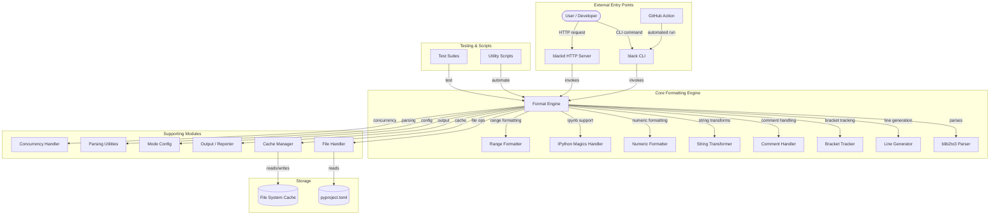
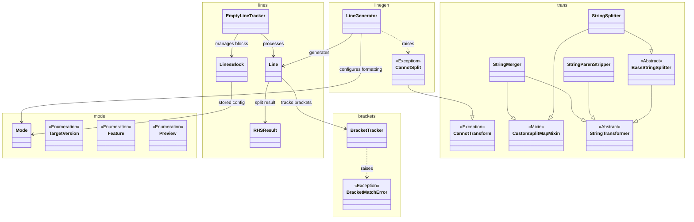
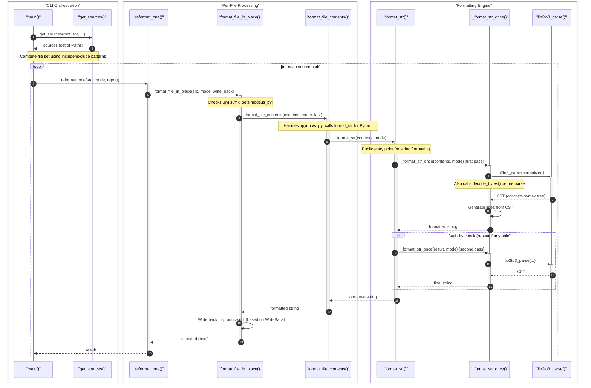
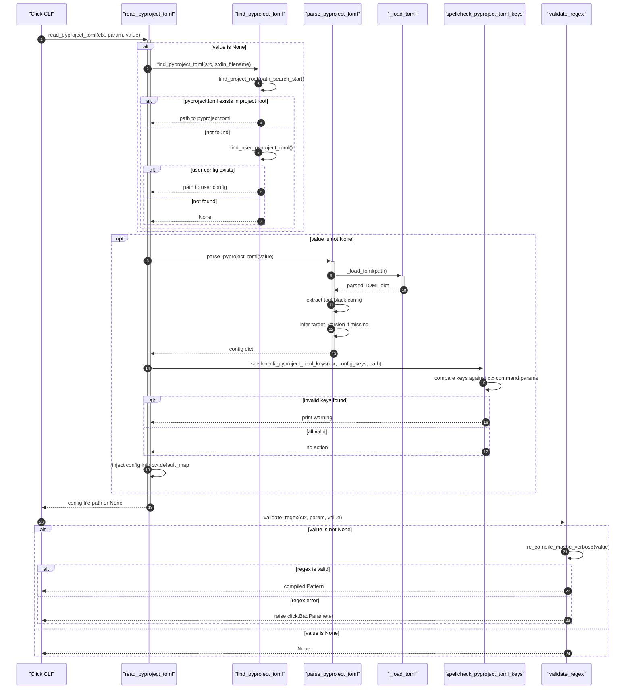
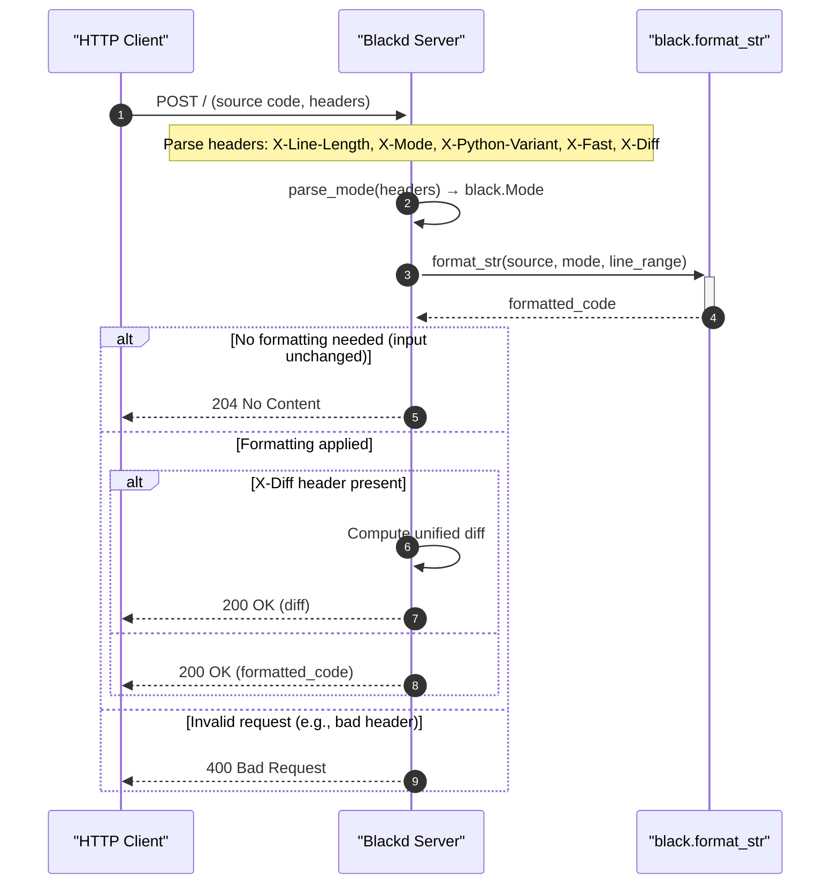
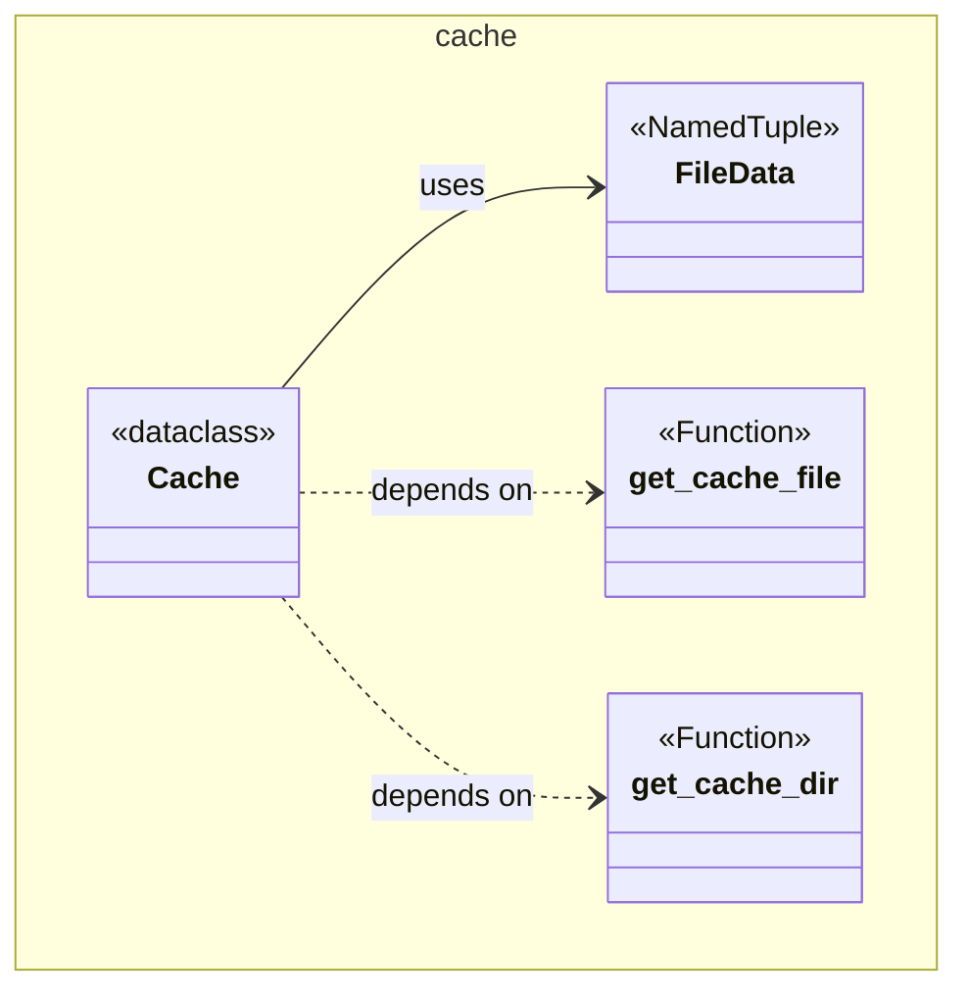

# System Architecture Documentation


The uncompromising Python code formatter. Black is an opinionated, deterministic formatter that reformats entire files in place, freeing developers from formatting debates and producing consistent, readable code across any project.

## Architecture

Black's architecture is organized around a multi-stage formatting pipeline that transforms raw Python source code into a consistently formatted output. The system is composed of several collaborating modules, each with a distinct responsibility.



### Core Formatting Pipeline

The formatting pipeline processes source code through three major phases:

1. **Parsing** — Raw source is tokenized and parsed into a concrete syntax tree (CST) using a custom fork of lib2to3 (`blib2to3`). This CST preserves whitespace and comments, unlike an AST.
2. **Line Generation** — The CST is walked by a `LineGenerator` visitor that produces `Line` objects. Each `Line` represents a logical line of formatted output, with leaves and attached comments. During this phase, the generator makes decisions about line splitting, bracket handling, and comment placement.
3. **Line Splitting and Output** — Lines that exceed the configured line length are split. String transformers (`StringMerger`, `StringSplitter`, `StringParenStripper`) handle string literal merging and splitting. The final lines are concatenated into the formatted output.



```text
┌──────────┐    ┌──────────────┐    ┌───────────┐    ┌──────────┐
│  Source  │───▶│   blib2to3   │───▶│  LineGen  │───▶│  Lines   │
│  Code    │    │   (parse)    │    │ (walk)    │    │ (split)  │
└──────────┘    └──────────────┘    └───────────┘    └──────────┘
                                                           │
                                                    ┌──────▼──────┐
                                                    │  Formatted  │
                                                    │   Output    │
                                                    └─────────────┘
```

### Key Components and Their Responsibilities

| Component | Module | Responsibility |
|-----------|--------|----------------|
| **BracketTracker** | `src/black/brackets.py` | Tracks bracket depth and delimiter priorities for line splitting decisions |
| **BracketMatchError** | `src/black/brackets.py` | Exception raised when bracket matching fails |
| **ProtoComment** | `src/black/comments.py` | Represents a comment in the syntax tree, storing type, value, whitespace, and newline information |
| **LineGenerator** | `src/black/linegen.py` | Generates reformatted `Line` objects from the CST, handling various Python constructs |
| **Line** | `src/black/lines.py` | Holds leaves and comments for a single line of code |
| **EmptyLineTracker** | `src/black/lines.py` | Calculates extra empty lines needed before and after each processed line |
| **Mode** | `src/black/mode.py` | Stores configuration settings: target versions, line length, feature flags |
| **TargetVersion** | `src/black/mode.py` | Defines supported Python versions for formatting |
| **Feature** | `src/black/mode.py` | Enumeration of Python language features supported by the formatter |
| **Preview** | `src/black/mode.py` | Individual preview style features for gradual opt-in |
| **Cache** | `src/black/cache.py` | Manages file system cache to avoid reformatting unchanged files |
| **StringTransformer** | `src/black/trans.py` | Abstract base for string merging, splitting, and parenthesis stripping |
| **StringMerger** | `src/black/trans.py` | Merges adjacent strings or removes backslash continuations |
| **StringSplitter** | `src/black/trans.py` | Splits atom strings to fit within line length |
| **DebugVisitor** | `src/black/debug.py` | Pretty-prints CST with indentation and color coding for debugging |
| **Report** | `src/black/report.py` | Tracks reformatting statistics and provides reporting |
| **Visitor** | `src/black/nodes.py` | Base visitor class for traversing lib2to3 syntax trees |
| **Ok / Err** | `src/black/rusty.py` | Result types inspired by Rust error handling |
| **BlackDClient** | `src/blackd/client.py` | HTTP client for the blackd server |
| **FileData** | `src/black/cache.py` | Stores metadata about a file for caching purposes |

### Formatting a Single File

When Black formats a file, the following sequence occurs:



1. The `reformat_one` function (in `src/black/__init__.py`) is called with the file path, mode, and options.
2. It checks the cache (if enabled and not in diff mode) to skip unchanged files.
3. The source is read, parsed by `blib2to3`, and fed through `_format_str_once`.
4. The formatted output is validated for stability (a second pass produces identical output) and, in safe mode, AST equivalence.
5. The result is written back according to the `WriteBack` strategy (in-place, diff, check, or color-diff).

### Configuration Loading

Black discovers configuration from `pyproject.toml`, a user-level config file, or command-line arguments. The `Mode` dataclass consolidates all formatting settings.



### Blackd HTTP Server

The `src/blackd/` package provides a lightweight aiohttp-based HTTP server that formats code on demand. It supports protocol version 1, configurable Python variants via headers, and CORS middleware for cross-origin requests from web clients.



The server's `handle` coroutine (in `src/blackd/__init__.py`) reads the request body, parses formatting options from headers, invokes the core formatting engine, and returns the result. Errors produce appropriate HTTP status codes (204 for no change, 400 for invalid input, 501 for unsupported protocol versions).

### Cache Management

The `Cache` class in `src/black/cache.py` avoids reformatting files whose content hasn't changed. It uses a hash of the file contents combined with the formatting mode to detect staleness.



### Safety Guarantees

Black provides two levels of safety:
- **Stable formatting** — The `assert_stable` function runs a second formatting pass to verify the output doesn't change.
- **AST equivalence** — In safe mode (`--safe`), `assert_equivalent` parses both the original and formatted code into ASTs and compares their stringified forms, ensuring no semantic changes.

## Project Structure

```
black/
├── action/                   # GitHub Action entrypoint
│   └── main.py               # Installs Black and runs it on specified sources
├── docs/                     # Sphinx documentation configuration
│   └── conf.py
├── profiling/                # Profiling test data
│   └── mix_small.py
├── scripts/                  # Development and release utilities
│   ├── diff_shades_gha_helper.py   # GitHub Actions integration with diff-shades
│   ├── release.py                  # Release automation (version bumping, changelog)
│   ├── release_tests.py            # Tests for release logic
│   ├── fuzz.py                     # Property-based fuzzing tests
│   ├── generate_schema.py          # JSON schema generation for config
│   ├── make_width_table.py         # Unicode width table generation
│   ├── migrate-black.py            # Git history rewriting tool
│   └── check_*.py                  # Documentation version consistency checks
├── src/
│   ├── black/                # Core formatter library
│   │   ├── __init__.py       # Main CLI and public API (format_str, format_file_in_place)
│   │   ├── __main__.py       # Entry point for `python -m black`
│   │   ├── brackets.py       # Bracket depth tracking and delimiter priority
│   │   ├── cache.py          # File system cache (FileData, Cache)
│   │   ├── comments.py       # Comment parsing and normalization (ProtoComment)
│   │   ├── concurrency.py    # Parallel file formatting (multiprocessing)
│   │   ├── const.py          # Default configuration constants
│   │   ├── debug.py          # CST pretty-printing (DebugVisitor)
│   │   ├── files.py          # File system operations, pyproject.toml parsing
│   │   ├── handle_ipynb_magics.py  # IPython magic masking for Jupyter cells
│   │   ├── linegen.py        # Line generation from CST (LineGenerator)
│   │   ├── lines.py          # Line data structures (Line, EmptyLineTracker, LinesBlock)
│   │   ├── mode.py           # Configuration (Mode, TargetVersion, Feature, Preview)
│   │   ├── nodes.py          # AST node transformation utilities (Visitor)
│   │   ├── numerics.py       # Numeric literal formatting (hex, octal, scientific)
│   │   ├── output.py         # Terminal output, diffs, file dumping
│   │   ├── parsing.py        # Source parsing and AST validation
│   │   ├── ranges.py         # Line range formatting (_LinesMapping, _TopLevelStatementsVisitor)
│   │   ├── report.py         # Formatting statistics and reporting (Report, Changed)
│   │   ├── resources/        # Static resources
│   │   ├── rusty.py          # Result types (Ok, Err)
│   │   ├── schema.py         # JSON configuration schema access
│   │   ├── strings.py        # String utility functions
│   │   ├── trans.py          # String transformers (StringMerger, StringSplitter, etc.)
│   │   └── _width_table.py   # Unicode character width table
│   ├── blackd/               # HTTP formatting server
│   │   ├── __init__.py       # Request handling, header parsing (HeaderError, InvalidVariantHeader)
│   │   ├── __main__.py       # Server CLI entry point
│   │   ├── client.py         # HTTP client (BlackDClient)
│   │   └── middlewares.py    # CORS middleware
│   └── blib2to3/             # Fork of lib2to3 parser
│       ├── pygram.py         # Python grammar export
│       ├── pytree.py         # Syntax tree node structures
│       └── pgen2/            # Parser generator engine
│           ├── driver.py     # High-level parsing interface
│           ├── grammar.py    # Grammar data structures
│           ├── parse.py      # Parser engine
│           ├── token.py      # Token constants
│           ├── tokenize.py   # Tokenizer
│           ├── conv.py       # C grammar conversion
│           └── literals.py   # String literal evaluation
├── tests/                    # Test suite
│   ├── conftest.py           # Pytest configuration
│   ├── data/cases/           # Hundreds of formatted/unformatted test cases
│   │   ├── preview_*         # Preview mode formatting tests
│   │   ├── fmtonoff*.py      # fmt: on/off directive tests
│   │   ├── fmtskip*.py       # fmt: skip directive tests
│   │   ├── line_ranges_*.py  # Line range formatting tests
│   │   ├── pep_*.py          # PEP-specific feature tests
│   │   ├── pattern_matching_*.py
│   │   ├── comments*.py      # Comment handling tests
│   │   └── ...               # Many more feature-specific test files
│   └── data/line_ranges_formatted/  # Expected outputs for line range tests
└── Dockerfile                # Container definition
```

### Key Directories Explained

- **`src/black/`** — The heart of the formatter. Contains the main formatting pipeline, configuration, caching, and all formatting logic from bracket tracking to string splitting.
- **`src/blackd/`** — A companion HTTP server that exposes Black's formatting capabilities over HTTP. Useful for editor integrations, web services, and CI pipelines.
- **`src/blib2to3/`** — A maintained fork of Python's `lib2to3` parser. Provides the CST parser that preserves whitespace and comments, which is essential for a formatter that must reproduce semantically identical code.
- **`tests/data/cases/`** — A comprehensive collection of test cases covering every formatting feature, edge case, and preview mode option. Each file is formatted and compared against a known-good output.
- **`scripts/`** — Developer utilities for release management, schema generation, documentation validation, and fuzzing.
- **`action/`** — A GitHub Action wrapper that installs Black and runs it on user-specified source files, with optional Jupyter support and version pinning.

For detailed information on setting up a development environment, running tests, and contributing, see the [Development Setup](DEVELOPMENT.md) and [Contributing Guidelines](CONTRIBUTING.md). The [Testing Guide](TESTING.md) provides comprehensive information about the test suite and how to write new tests.

## License

MIT