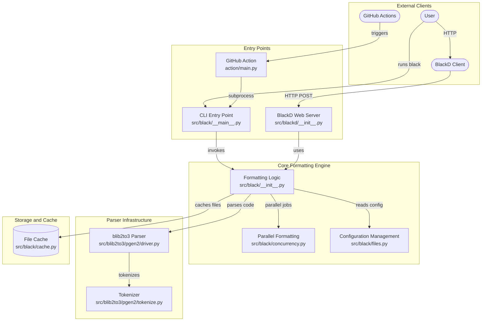
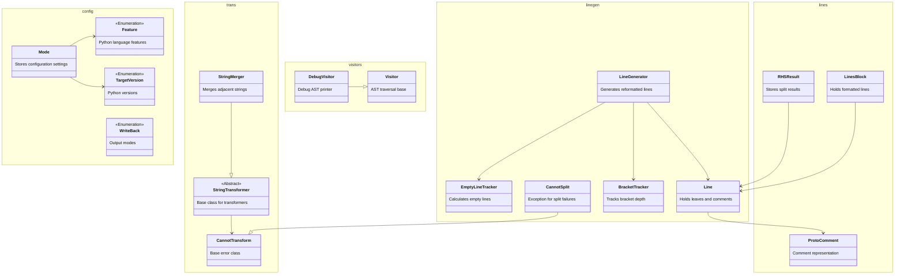
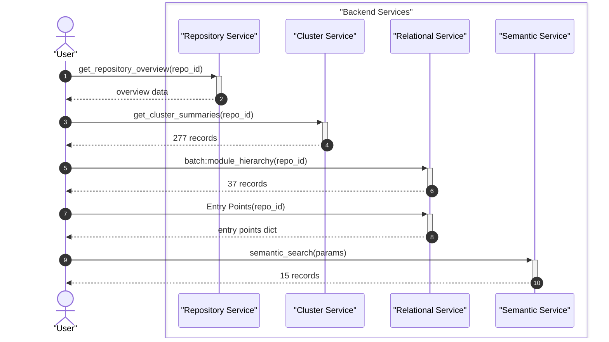

# System Architecture Documentation

The uncompromising Python code formatter


Black is an opinionated Python code formatter that provides deterministic, consistent formatting with no configuration required. It operates as both a command-line tool and an HTTP service ([blackd](API.md)), processing Python source code through a multi-stage pipeline that parses, transforms, and re-emits syntactically correct, uniformly styled code. Whether you're enforcing style across a team or just want to stop thinking about formatting, Black handles it for you.

---

## Architecture

Black's system is organized around a **formatting pipeline** that transforms Python source code from raw text to consistently styled output. The pipeline flows through several distinct stages, each handled by dedicated modules.

### High-Level Pipeline

```
┌──────────────┐    ┌──────────────┐    ┌──────────────┐    ┌──────────────┐    ┌──────────┐
│  Source Text │───▶│ Tokenization │───▶│   Parsing    │───▶│  Line Gen &  │───▶│  Output  │
│              │    │ (blib2to3)   │    │ (blib2to3)   │    │  Transform   │    │          │
└──────────────┘    └──────────────┘    └──────────────┘    └──────────────┘    └──────────┘
                                                                                     │
                                                           ┌─────────────────────────┤
                                                           │                         │
                                                           ▼                         ▼
                                                   ┌──────────────┐          ┌──────────────┐
                                                   │  Formatted   │          │   Diff /     │
                                                   │  Source Text │          │   Check      │
                                                   └──────────────┘          └──────────────┘
```

### Core Subsystems

**1. Parser & AST Infrastructure (`src/blib2to3/`)**

Black ships with its own parser, a fork of Python's `lib2to3`, because it needs a concrete syntax tree (CST) that preserves all original formatting details — including whitespace, comments, and parentheses. This is essential for a formatter that aims to be deterministic and idempotent.

Key components:
- **`pgen2/tokenize.py`** — Tokenizes Python source into a stream of tokens
- **`pgen2/parse.py`** — Core parser engine that builds the CST from token streams using grammar tables
- **`pgen2/driver.py`** — High-level interface that orchestrates parsing of files into syntax trees
- **`pgen2/grammar.py`** — Defines grammar data structures and operator precedence mappings
- **`pgen2/token.py`** — Token constants shared between tokenizer and parser
- **`pytree.py`** — Defines `Node` and `Leaf` structures that form the concrete syntax tree, including pattern matching for tree traversal
- **`pygram.py`** — Exports the Python grammar and symbol tables, initializing them on demand

The parser is invoked through `src/black/parsing.py`, which provides the `lib2to3_parse` function and handles error reporting via `InvalidInput`, `SourceASTParseError`, and `ASTSafetyError` exceptions. The AST safety check ensures Black's output is semantically equivalent to the input.

**2. Formatting Engine (`src/black/`)**

The formatting engine takes the CST and produces reformatted `Line` objects. This is the heart of Black's logic.

- **`linegen.py`** — The `LineGenerator` walks the CST and produces `Line` objects. It handles all Python constructs — imports, function definitions, class bodies, comprehensions, match/case statements, and more. When a line exceeds the configured length, it uses `BracketTracker` to find optimal split points.
- **`lines.py`** — Defines the `Line` data structure (holds leaves and comments for one output line), `LinesBlock` (for tracking empty line behavior), and `EmptyLineTracker` (stateful logic for inserting blank lines between code blocks).
- **`brackets.py`** — `BracketTracker` monitors bracket depth and delimiter priorities during line splitting, ensuring splits happen at the most readable positions.
- **`trans.py`** — String transformers (`StringMerger`, `StringSplitter`, `StringParenStripper`, etc.) handle the complex task of splitting long strings across lines while preserving correct Python string syntax.
- **`strings.py`** — String manipulation utilities supporting the transformers.
- **`numerics.py`** — Formats and normalizes numeric literals (hex, scientific notation, complex numbers, underscores).
- **`comments.py`** — Parses and normalizes comments, handles formatting directives like `# fmt: off` and `# fmt: skip`, and represents comments via the `ProtoComment` data class.
- **`nodes.py`** — Utility functions for traversing and transforming CST nodes and leaves, built on the `Visitor` base class.
- **`ranges.py`** — Handles selective formatting of specific line ranges, allowing partial formatting of files.

**3. Configuration & Mode (`src/black/mode.py`)**

All formatting behavior is controlled through the `Mode` data class, which encapsulates:
- `TargetVersion` — which Python versions to target (affects available syntax)
- `line_length` — maximum line length (default 88)
- `Preview` — individual preview-style features that may become defaults in future releases
- `Feature` — Python language features detected in the source code

**4. File Discovery & Caching**

- **`files.py`** — Discovers Python files to format, finds project roots, and parses configuration from `pyproject.toml`. Handles `.gitignore` patterns, include/exclude filters, and multi-source directory traversal.
- **`cache.py`** — The `Cache` class stores file metadata (`FileData`: modification time, size, hash) to skip reformatting unchanged files, dramatically improving performance on large codebases.
- **`concurrency.py`** — Provides multiprocessing and async utilities for formatting multiple files in parallel.

**5. Output & Reporting**

- **`output.py`** — Generates diffs, handles colored terminal output, and writes reformatted files back to disk.
- **`report.py`** — `Report` tracks formatting statistics (files changed, unchanged, errors) and `NothingChanged` signals when no reformatting was needed.

**6. HTTP Server (`src/blackd/`)**

Black provides an optional HTTP daemon (`blackd`) for remote formatting:

- **`__init__.py`** — Defines HTTP routes, request/response headers (e.g., `X-Target-Version`, `X-Line-Length`, `X-Preview`), and error classes (`HeaderError`, `InvalidVariantHeader`).
- **`client.py`** — `BlackDClient` provides a Python client for interacting with the blackd server.
- **`middlewares.py`** — CORS middleware for aiohttp, enabling browser-based usage.
- **`__main__.py`** — CLI entry point for launching the server.







### Key Design Decisions

- **Concrete Syntax Tree over Abstract Syntax Tree**: Black uses a CST (via blib2to3) rather than Python's `ast` module because the CST preserves all whitespace, comments, and parentheses — information essential for faithful reformatting. An AST safety check (`ASTSafetyError`) validates that output is semantically equivalent.
- **Deterministic formatting**: Given the same input and configuration, Black always produces the same output. This is critical for idempotency — running Black on already-formatted code produces no changes.
- **Opinionated defaults**: The 88-character line length and formatting rules are chosen to maximize readability across a wide range of Python code, reducing bikeshedding.
- **Preview mode**: Experimental formatting improvements are gated behind the `Preview` enumeration, allowing users to opt in before features become defaults.

---

## Project Structure

```
black/
├── src/
│   ├── black/                  # Core formatting engine
│   │   ├── __init__.py         # Main entry point & public API (format_str, format_file_contents, etc.)
│   │   ├── __main__.py         # CLI entry point
│   │   ├── mode.py             # Configuration: Mode, TargetVersion, Preview, Feature
│   │   ├── linegen.py          # LineGenerator — transforms CST into formatted Line objects
│   │   ├── lines.py            # Line, LinesBlock, EmptyLineTracker data structures
│   │   ├── brackets.py         # BracketTracker for split-point detection
│   │   ├── trans.py            # String transformers (merge, split, strip)
│   │   ├── strings.py          # String manipulation utilities
│   │   ├── numerics.py         # Numeric literal normalization
│   │   ├── comments.py         # Comment parsing & fmt: directive handling
│   │   ├── nodes.py            # CST node/leaf utilities & Visitor base class
│   │   ├── parsing.py          # Parse orchestration & AST safety validation
│   │   ├── ranges.py           # Line-range selective formatting
│   │   ├── files.py            # File discovery, .gitignore, project root detection
│   │   ├── cache.py            # File caching to skip unchanged files
│   │   ├── concurrency.py      # Multiprocessing & async formatting
│   │   ├── output.py           # Diff generation & file writing
│   │   ├── report.py           # Formatting statistics & reporting
│   │   ├── const.py            # Default configuration constants
│   │   ├── debug.py            # CST pretty-printing (DebugVisitor)
│   │   ├── rusty.py            # Rust-style Result type (Ok/Err)
│   │   ├── schema.py           # JSON schema for configuration validation
│   │   ├── _width_table.py     # Unicode character width table
│   │   ├── handle_ipynb_magics.py  # IPython/Jupyter magic command handling
│   │   └── resources/          # Package data resources
│   ├── blackd/                 # HTTP daemon for remote formatting
│   │   ├── __init__.py         # Routes, headers, error classes
│   │   ├── __main__.py         # Server entry point
│   │   ├── client.py           # BlackDClient HTTP client
│   │   └── middlewares.py      # CORS middleware for aiohttp
│   └── blib2to3/               # Forked lib2to3 parser
│       ├── __init__.py
│       ├── pygram.py           # Grammar & symbol table exports
│       ├── pytree.py           # CST Node & Leaf structures
│       └── pgen2/              # Parser generator runtime
│           ├── __init__.py
│           ├── driver.py       # High-level parse interface
│           ├── parse.py        # Core parser engine
│           ├── grammar.py      # Grammar data structures
│           ├── token.py        # Token constants
│           ├── tokenize.py     # Python tokenizer
│           ├── pgen.py         # Parser generator
│           ├── conv.py         # C-to-Python grammar converter
│           └── literals.py     # Safe string literal evaluation
├── tests/                      # Test suite
│   ├── conftest.py             # Pytest configuration & custom options
│   └── data/cases/             # Formatting test cases (input/output pairs)
├── scripts/                    # Development & release automation
│   ├── release.py              # Release versioning & changelog automation
│   ├── release_tests.py        # Tests for release logic
│   ├── generate_schema.py      # JSON schema generation
│   ├── make_width_table.py     # Unicode width table generation
│   ├── fuzz.py                 # Property-based fuzzing tests
│   ├── diff_shades_gha_helper.py  # GitHub Actions diff-shades integration
│   ├── migrate-black.py        # Git history rewriting with Black
│   ├── check_pre_commit_rev_in_example.py   # Doc consistency checks
│   └── check_version_in_basics_example.py   # Doc consistency checks
├── action/
│   └── main.py                 # GitHub Action entry point
├── profiling/
│   └── mix_small.py            # Profiling test data
├── docs/
│   └── conf.py                 # Sphinx documentation configuration
└── Dockerfile                  # Container build configuration
```

### Module Responsibilities Summary

| Module | Role |
|--------|------|
| `src/black/__init__.py` | Public API: `format_str()`, `format_file_contents()`, `main()` |
| `src/black/linegen.py` | CST → Line transformation (the formatting core) |
| `src/black/trans.py` | String splitting/merging transformers |
| `src/black/mode.py` | Configuration data structures |
| `src/black/files.py` | File discovery & configuration loading |
| `src/blackd/` | HTTP formatting service |
| `src/blib2to3/` | Python parser (concrete syntax tree) |
| `tests/data/cases/` | Formatting test cases covering features like `fmt: skip` handling, redundant parentheses removal, docstring blank line handling, import line collapse, numeric literal formatting, and line range differencing |