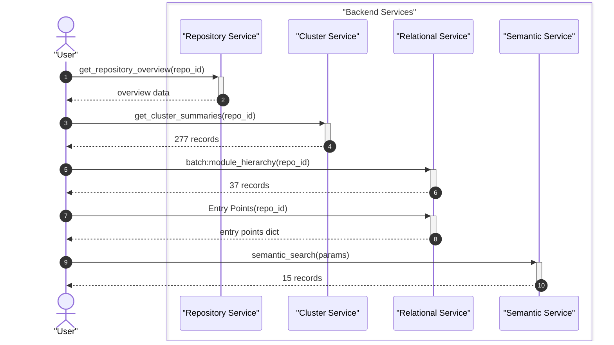
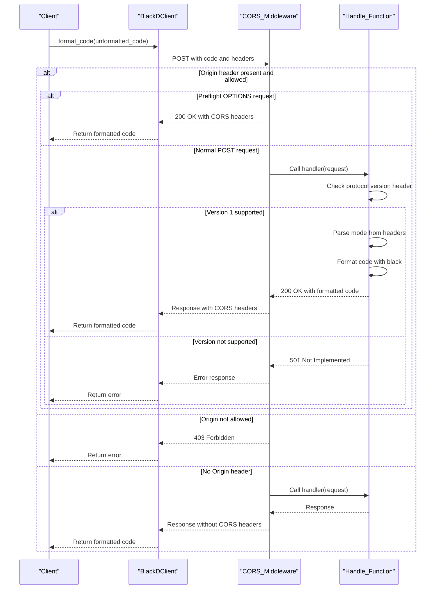

# Development Setup and Workflow

Everything you need to start contributing to Black's codebase, from cloning to running your first test.


Black is the uncompromising Python code formatter. This guide walks you through setting up a local development environment, understanding the project layout, running the test suite, and navigating the codebase so you can contribute with confidence. Whether you're fixing a bug, adding a formatting rule, or improving documentation, you'll find everything you need here.

## Overview

The Black repository is organized into four main areas:

| Area | Location | Purpose |
|------|----------|---------|
| Core formatter | `src/black/` | Formatting engine, configuration, and CLI entry point |
| HTTP server | `src/blackd/` | `blackd` daemon and its HTTP client |
| Parser | `src/blib2to3/` | Forked lib2to3 parser with grammar and tokenizer |
| Tests | `tests/` | Test suite, configuration, and formatting test cases |
| Scripts | `scripts/` | Release automation, schema generation, and CI helpers |
| GitHub Action | `action/` | GitHub Actions entrypoint for running Black |

Key source modules inside `src/black/` include:

- **`__init__.py`** — Main entry point and core formatting logic
- **`linegen.py`** — Generates reformatted `Line` objects from the syntax tree
- **`lines.py`** — Line manipulation utilities and `EmptyLineTracker`
- **`brackets.py`** — Bracket depth tracking and delimiter priority for line splitting
- **`trans.py`** — String transformers for splitting and merging string literals
- **`parsing.py`** — Source code parsing and AST safety validation
- **`mode.py`** — Configuration data structures (`Mode`, `TargetVersion`, `Preview`, `Feature`)
- **`files.py`** — File discovery, project root detection, and config parsing
- **`comments.py`** — Comment parsing and formatting directives like `fmt: off`
- **`ranges.py`** — Formatting of specific line ranges within source code
- **`cache.py`** — File caching to avoid reformatting unchanged files

For a deeper look at how these components interact, see [ARCHITECTURE.md](ARCHITECTURE.md).

## Installation

Clone the repository and install Black in development mode:

```bash
git clone https://github.com/psf/black.git
cd black
pip install -e ".[dev]"
```

To verify the installation, run Black against a sample file:

```bash
echo 'x  =  1' | python -m black --check -
```

You can also build and run Black via the provided Docker image:

```bash
docker build -t black .
docker run -i black --check - < your_file.py
```

## Development

### Project layout at a glance

```
black/
├── src/
│   ├── black/           # Core formatter package
│   ├── blackd/          # HTTP daemon and client
│   └── blib2to3/        # Parser (grammar, tokenizer, driver)
├── tests/
│   ├── conftest.py      # Pytest configuration and custom options
│   └── data/cases/      # Formatting test case files
├── scripts/             # Release, schema, and CI utility scripts
├── action/              # GitHub Actions entrypoint
└── Dockerfile
```

### Available scripts

The `scripts/` directory contains several utility scripts for maintainers:

| Script | Purpose |
|--------|---------|
| `scripts/release.py` | Automates release-related changes (version bumping, changelogs) |
| `scripts/release_tests.py` | Unit tests for release versioning logic |
| `scripts/generate_schema.py` | Generates the JSON schema for Black's configuration options |
| `scripts/make_width_table.py` | Generates a Unicode width table for character display calculations |
| `scripts/fuzz.py` | Property-based fuzzing tests for the formatter |
| `scripts/migrate-black.py` | Rewrites git history by applying Black to individual commits |
| `scripts/diff_shades_gha_helper.py` | GitHub Actions helper for diff-shades PR analysis |
| `scripts/check_pre_commit_rev_in_example.py` | Validates pre-commit rev consistency in documentation |
| `scripts/check_version_in_basics_example.py` | Validates version consistency in documentation examples |

### Code formatting and linting

Since Black is its own best test case, the codebase is formatted with Black itself. Any changes you make should be run through the formatter before committing:

```bash
python -m black src/ tests/ scripts/
```

### Pre-commit hooks

The repository includes scripts for validating documentation consistency:

- `scripts/check_pre_commit_rev_in_example.py` — Checks that pre-commit hook revisions in docs match expectations
- `scripts/check_version_in_basics_example.py` — Validates that version numbers in documentation examples are consistent

See [CONTRIBUTING.md](CONTRIBUTING.md) for details on the recommended pre-commit setup and code standards.

### Configuration system

Black's formatter behavior is controlled through several configuration layers defined in `src/black/`:

- **`mode.py`** — Defines the `Mode` dataclass with settings like `target_versions`, `line_length`, `string_normalization`, and `preview` features
- **`const.py`** — Default configuration constants used across the formatter
- **`schema.py`** — Provides access to Black's JSON schema for configuration validation (generated by `scripts/generate_schema.py`)
- **`files.py`** — Handles discovering configuration from `pyproject.toml` and other config files

Environment variables used by the GitHub Action (`action/main.py`) include:

| Variable | Description | Default |
|----------|-------------|---------|
| `INPUT_OPTIONS` | Command-line options to pass to Black | `""` |
| `INPUT_SRC` | Source files or directories to format | `""` |
| `INPUT_VERSION` | Specific Black version to install | `""` |
| `INPUT_USE_PYPROJECT` | Read version from `pyproject.toml` | `false` |
| `INPUT_JUPYTER` | Enable Jupyter notebook formatting | `false` |
| `OUTPUT_FILE` | File to write Black output to | `""` |

## Testing

Black has an extensive test suite that covers formatting edge cases, the parser, the HTTP daemon, and more. Test case files live in `tests/data/cases/` and include scenarios such as:

- **`fmtskip*.py`** — Tests for `# fmt: skip` directive handling, including comments in bracket expressions and type ignore directives
- **`line_ranges_*.py`** — Tests for formatting specific line ranges, including boundary conditions and diff edge cases
- **`comments*.py`** — Tests for comment placement and formatting across various contexts
- **`import_line_collapse.py`** — Tests for import line collapse formatting behavior
- **`numeric_literals.py`** — Tests for numeric literal formatting (hex, scientific notation, complex numbers)
- **`pyi_docstring_blank_lines_no_preview.py`** — Tests for docstring blank line handling in `.pyi` stub files

The `tests/conftest.py` file provides custom pytest options including `--print-full-tree` and `--print-tree-diff` for inspecting syntax tree output during debugging.

For a complete guide to running tests, understanding the test structure, and writing new tests, see [TESTING.md](TESTING.md).

## Architecture

The formatting pipeline flows through several stages: source code is parsed into a syntax tree by `blib2to3`, transformed into `Line` objects by `linegen.py`, and then written back as formatted output. String transformations happen in `trans.py`, bracket splitting decisions are made in `brackets.py`, and empty line insertion is managed by `EmptyLineTracker` in `lines.py`.



For a comprehensive view of the system architecture, component relationships, and data flow, see [ARCHITECTURE.md](ARCHITECTURE.md).

## Command-Line Interface

The `black` command-line interface is defined primarily in `src/black/__init__.py` and exposes options for target version selection, line length, string normalization, preview features, and more.



For a detailed reference of all CLI options and usage patterns, see [CLI.md](CLI.md). The `blackd` HTTP API is covered in [API.md](API.md).

## Additional Documentation

- [ARCHITECTURE.md](ARCHITECTURE.md) — System architecture, components, and data flow
- [CONTRIBUTING.md](CONTRIBUTING.md) — How to participate in the project, coding standards, and PR process
- [API.md](API.md) — `blackd` HTTP API conceptual guide
- [CLI.md](CLI.md) — Command-line interface reference
- [TESTING.md](TESTING.md) — How to run and write tests