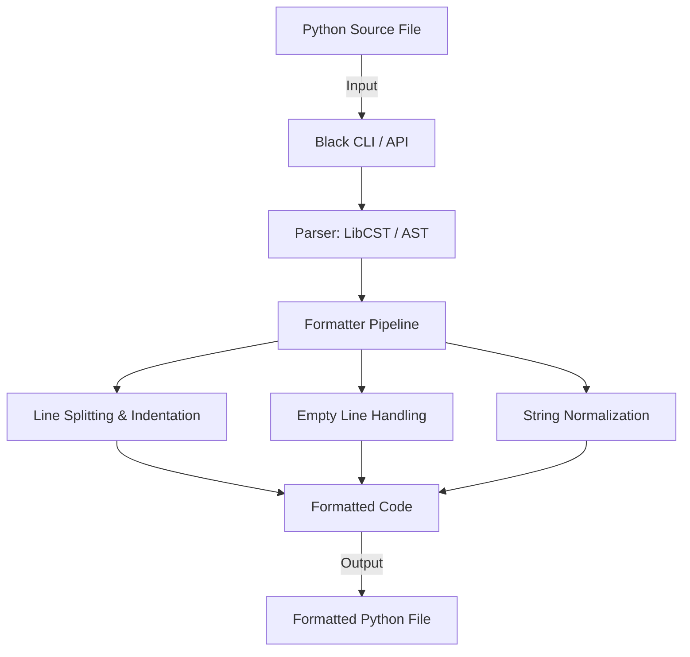

# Black: The uncompromising Python code formatter

## Project Description

Black is a code formatter for Python. With a focus on consistency and minimal configuration, it automatically reformats Python source code to comply with the official PEP 8 style guide and Black's own opinionated style. It is designed to eliminate debates about formatting and enforce a single, deterministic output.

## System Architecture

Black is a standalone command‑line tool and library with no external dependencies beyond Python. The following diagram illustrates its high‑level architecture:

The tool can be invoked via the command line or used programmatically through its Python API. All processing is performed locally—no network calls or persistent state.

## Services / Components

- **CLI (`black` command)** – The primary entry point for users. Parses command‑line arguments, discovers files, and invokes the formatting engine.
- **Core Formatter (library)** – Contains the parsing logic (using `libcst` or the built‑in `ast` module) and a pipeline of transformations:
  - *Line Splitting & Indentation* – Ensures code fits within the configured line length.
  - *Empty Line Handling* – Adds or removes blank lines according to PEP 8 and Black’s rules.
  - *String Normalization* – Standardizes quotes, line endings, and whitespace.
- **Config** – Reads configuration from `pyproject.toml`, `setup.cfg`, or inline comments. Controls settings like line length, target versions, and whether to use preview style.

## Communication Patterns

- **Local Execution** – Black runs entirely on the user’s machine. There are no network services, databases, or inter‑repository dependencies.
- **CLI / API** – The primary communication is via the standard input/output/error streams (CLI) or direct function calls (API). Users provide Python source files, and Black returns the formatted version.
- **Idempotent & Stateless** – Each invocation is independent; Black does not maintain any shared state across runs. The only persistent effect is the modification of source files on disk (when not in `--check` or `--diff` mode).