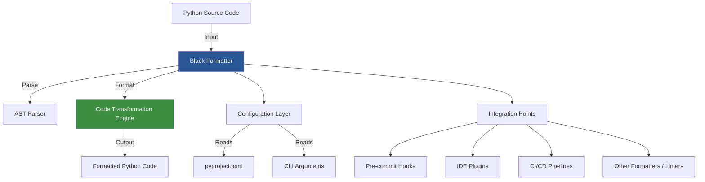

# Black: The Uncompromising Python Code Formatter

Black is a deterministic Python code formatter that reformats entire files in place. It is opinionated and requires no configuration to use, making Python code more consistent and easier to read across teams and projects.

## System Architecture

Black is a standalone tool designed to operate independently within the Python ecosystem. It integrates with standard development workflows and toolchains rather than relying on external microservices.

## Services / Components

As a standalone tool, Black consists of several internal components rather than distributed services:

| Component | Description |
|-----------|-------------|
| **CLI Interface** | Command-line interface for invoking Black with file paths, options, and configuration arguments |
| **AST Parser** | Parses Python source code into an Abstract Syntax Tree using Python's built-in parser |
| **Code Transformation Engine** | The core formatting logic that applies Black's opinionated style rules to the AST |
| **Output Generator** | Converts the transformed AST back into formatted Python source code |
| **Configuration Layer** | Handles reading configuration from `pyproject.toml`, CLI flags, and default settings |
| **Diff Engine** | Provides diff output and check mode to compare original vs. formatted code |

## Communication Patterns

Black operates as a single-process command-line tool with the following interaction patterns:

### External Integrations

| Integration Type | Pattern | Description |
|------------------|---------|-------------|
| **File I/O** | Read/Write | Reads Python source files and writes formatted output in place |
| **Pre-commit Framework** | Hook-based | Executes as a pre-commit hook via `.pre-commit-config.yaml` |
| **IDE Integration** | Process invocation | Editors (VS Code, PyCharm, etc.) invoke Black as a subprocess |
| **CI/CD Systems** | CLI execution | GitHub Actions, GitLab CI, and other pipelines run Black in check mode |
| **Linter Ecosystem** | File sharing | Works alongside tools like `isort`, `flake8`, and `mypy` by formatting the same source files |

### Internal Data Flow

1. **Input Processing**: Accepts file paths, directories, or stdin input
2. **Parsing**: Converts source code to AST representation
3. **Formatting**: Applies deterministic formatting rules
4. **Output**: Returns formatted code to stdout, files, or diff output

---

*Black's philosophy: "Any color you want, as long as it's black." — It provides one true style, eliminating bikeshedding about Python code style.*