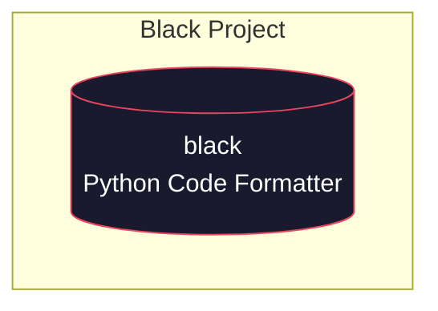

# Black

**The uncompromising Python code formatter.**

Black is a Python code formatter that enforces a consistent style across your codebase by parsing it into an abstract syntax tree and reformatting it according to its opinionated rules. It is designed to be used as a command-line tool and can be integrated into editors, CI pipelines, and pre-commit hooks. Black's formatting decisions are deliberately non-configurable, eliminating style debates and ensuring uniform code style across teams and projects.

---

## System Architecture

> Black is currently a **standalone, self-contained tool** with no dependencies on sibling repositories.

---

## Services / Components

### 🔧 `black` — Main Service

| Property | Value |
|----------|-------|
| **Repository** | `audoclyphia-evals/black` |
| **Role** | Primary (and only) service |
| **Language** | Python |
| **Description** | The uncompromising Python code formatter |

`black` is the core and sole component of this project. It provides:

- **Code Formatting**: Takes Python source code as input and outputs consistently formatted code.
- **AST-Based Processing**: Parses source code into an abstract syntax tree, applies formatting rules, and reconstructs the output.
- **CLI Interface**: A command-line interface for formatting files, directories, or standard input.
- **Editor & CI Integration**: Can be used as a pre-commit hook, within editor plugins, or as part of continuous integration pipelines.

---

## Communication Patterns

**No cross-repository communication.**

Black is a **standalone module** with no outbound or inbound calls to other repositories in this project. It operates independently as a self-contained Python package with no external service dependencies.

| Pattern | Details |
|---------|---------|
| **Integration Style** | N/A — Single standalone service |
| **Inbound Calls** | None |
| **Outbound Calls** | None |
| **Cross-Repo Boundaries** | None |

---

*This project currently consists of a single repository. As the project evolves and additional services or companion repositories are introduced, this documentation will be updated to reflect the expanded architecture and communication patterns.*