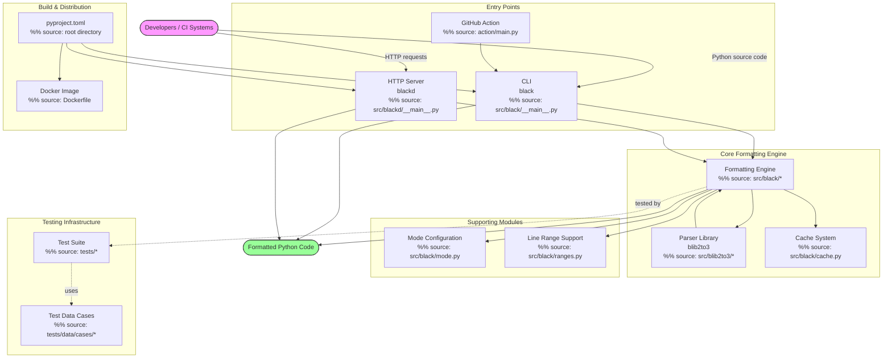

# Black

**The uncompromising Python code formatter**


Black is an opinionated Python code formatter that enforces a consistent style across your codebase. It parses your code into an AST and reformats it according to Black's rules, removing the burden of style debates from development.

---

## Project Overview

This repository contains the core Black formatter, including the CLI tool, the HTTP server daemon (`blackd`), the `blib2to3` parser library, and the Core Formatting Engine. Black reformats entire files in place, making code style enforcement trivial. For a deeper look at the architecture, see the [Architecture Overview](docs/ARCHITECTURE.md).

The main components are:

- **`src/black/`** — Core formatting logic, CLI entry point, caching, and utilities.
- **`src/blackd/`** — HTTP server for remote formatting.
- **`src/blib2to3/`** — Python parser fork providing syntax tree representation.



---

## Features

- **Deterministic formatting** — Same input always produces the same output.
- **Zero configuration** — Works out of the box with sensible defaults.
- **AST safety check** — Validates that reformatted code produces the same AST as the original.
- **Line length control** — Configurable maximum line length (default: 88).
- **Magic trailing comma** — Respects trailing commas in collections for line splitting.
- **String normalization** — Converts string quotes to double quotes (configurable).
- **IPython/Jupyter support** — Formats code cells in Jupyter notebooks via `--ipynb`.
- **Line range formatting** — Format only specific line ranges with `--line-ranges`.
- **Caching** — Skips unchanged files for faster repeated runs.
- **Parallel formatting** — Processes multiple files concurrently.
- **Docker support** — Available as a container image for CI/CD integration.
- **HTTP daemon mode** (`blackd`) — Exposes formatting via an HTTP API.

These capabilities are accessible through the various entry points detailed below. The following requirements must be met to use them.

---

## Requirements

- Python 3.8 or higher (Docker image uses Python 3.13).
- pip (Python package manager).
- Optional: `colorama` for colored output on Windows.
- Optional: `uvloop` for faster event loop in `blackd`.

---

## Installation

### Via pip (recommended)

```bash
pip install black
```

### With optional extras

```bash
# For colored output and the HTTP daemon
pip install "black[colorama,d]"

# For faster HTTP daemon with uvloop
pip install "black[colorama,d,uvloop]"
```

### From source

```bash
git clone https://github.com/psf/black.git
cd black
pip install -e .
```

### Via Docker

```bash
docker build -t black .
docker run --rm -v $(pwd):/src black /src/your_file.py
```

Once installed, you can begin formatting code immediately using the commands outlined in the Quick Start guide.

---

## Quick Start

Format a single file:

```bash
black your_file.py
```

Format an entire directory:

```bash
black src/
```

Check if files need formatting (without modifying):

```bash
black --check src/
```

Preview changes as a diff:

```bash
black --diff your_file.py
```

For more advanced usage options, consult the full Usage guide.

---

## Usage

### Command Line Interface

Format files in place:

```bash
black my_script.py
```

Format with a custom line length:

```bash
black --line-length 100 my_script.py
```

Target a specific Python version:

```bash
black --target-version py310 my_script.py
```

Skip the magic trailing comma behavior:

```bash
black --skip-magic-trailing-comma my_script.py
```

Format only specific line ranges:

```bash
black --line-ranges=10-20 my_script.py
```

Disable string normalization (preserve original quotes):

```bash
black --string-normalization=False my_script.py
```

### Programmatic API

You can use Black as a library within your Python code. The following examples demonstrate its core functions. For detailed information about all available functions, classes, and their parameters, see the [API Reference](#api-reference).

Format a code string directly:

```python
import black

source = "x  =  1"
formatted = black.format_str(source, mode=black.Mode())
print(formatted)  # Output: x = 1
```

Format with specific options:

```python
import black

source = "x: str|int = None"
mode = black.Mode(
    target_versions={black.TargetVersion.PY310},
    line_length=100,
)
formatted = black.format_str(source, mode=mode)
```

Format file contents and check equivalence:

```python
import black

source = open("my_module.py").read()
try:
    formatted = black.format_str(source, mode=black.Mode())
    print("Formatting successful")
except black.ASTSafetyError:
    print("AST mismatch — formatting changed code semantics")
except black.InvalidInput:
    print("Could not parse source code")
```

### HTTP Daemon (blackd)

For information on deploying Black as a service, see the [blackd HTTP Server Guide](docs/BLACKD_SERVER.md).

Start the server:

```bash
python -m blackd
```

Send a formatting request:

```bash
curl -X POST http://localhost:8180/ -d 'x=1'
```

Use the Python client:

```python
from blackd import BlackDClient

client = BlackDClient()
result = await client.format_code("x  =  1")
```

---

## API Reference

This section provides a summary of the available programmatic interface. For the complete, detailed specification of all endpoints, parameters, and data models, refer to the generated OpenAPI documentation: [`api_documentation.yaml`](api_documentation.yaml).

The library's primary entry point for formatting strings is `black.format_str()`. Errors like `ASTSafetyError` and `InvalidInput` can be raised during formatting. The `black.Mode` class is used to configure formatting behavior. For the HTTP daemon's client and endpoints, see the guide linked in the [Usage](#usage) section.

---

## 📚 Additional Documentation

For more detailed information, see the following documentation:

- [Black Architecture Overview](docs/ARCHITECTURE.md) - Provides a comprehensive overview of the system architecture, module organization, and data flow. Essential for contributors to understand the overall structure before diving into specific components.
- [Core Formatting Engine Guide](docs/CORE_FORMATTER.md) - Explains the core formatting logic including line splitting, empty line tracking, and string transformations. This is the heart of Black's functionality and requires detailed explanation of the complex algorithms involved.
- [Parser & Grammar Library (blib2to3)](docs/PARSER_LIBRARY.md) - Documents the parser and grammar management system that provides the syntax trees for formatting. Explains the NFA/DFA construction, token handling, and pattern matching that enable Black's Python parsing capabilities.
- [Blackd HTTP Server Guide](docs/BLACKD_SERVER.md) - Explains the HTTP server mode for remote code formatting. Covers request handling, CORS configuration, async execution, and client integration. Important for users deploying Black as a service.
- [Testing Guide for Black](docs/TESTING.md) - Documents the testing infrastructure, test data organization, and how to write new test cases. The extensive test suite (Clusters 10-99) requires clear documentation for effective contribution.
- [Contributing to Black](docs/CONTRIBUTING.md) - Guidelines for contributors including development setup, code style, testing procedures, and PR requirements. Essential for maintaining code quality across the large codebase.