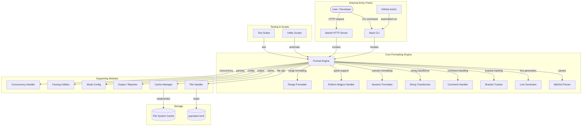
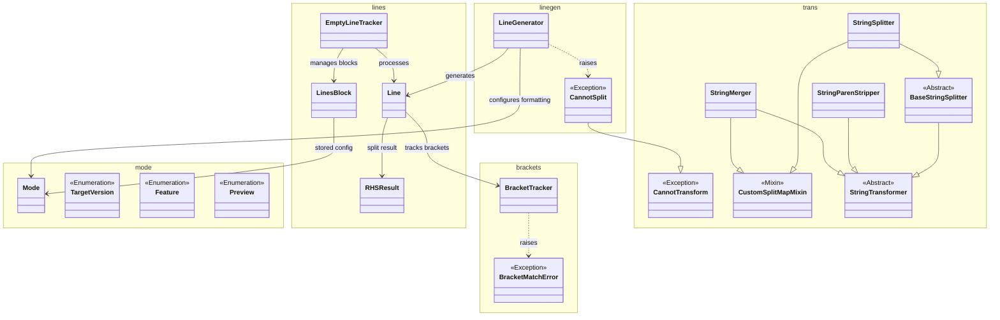
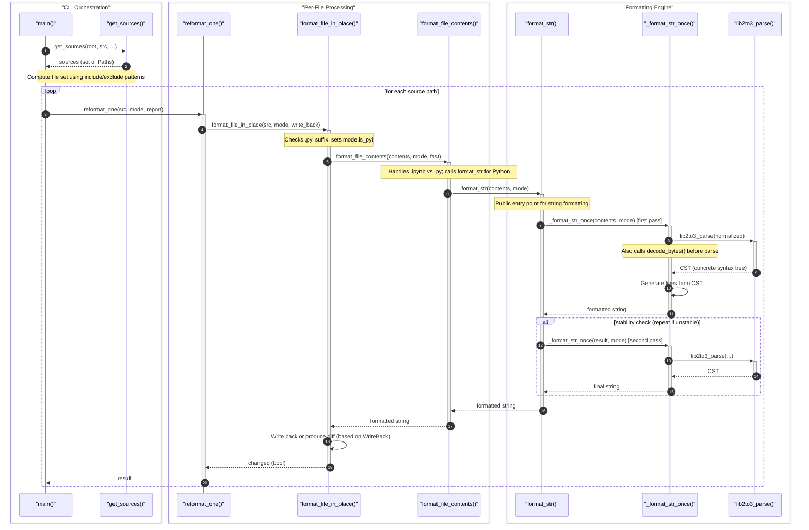
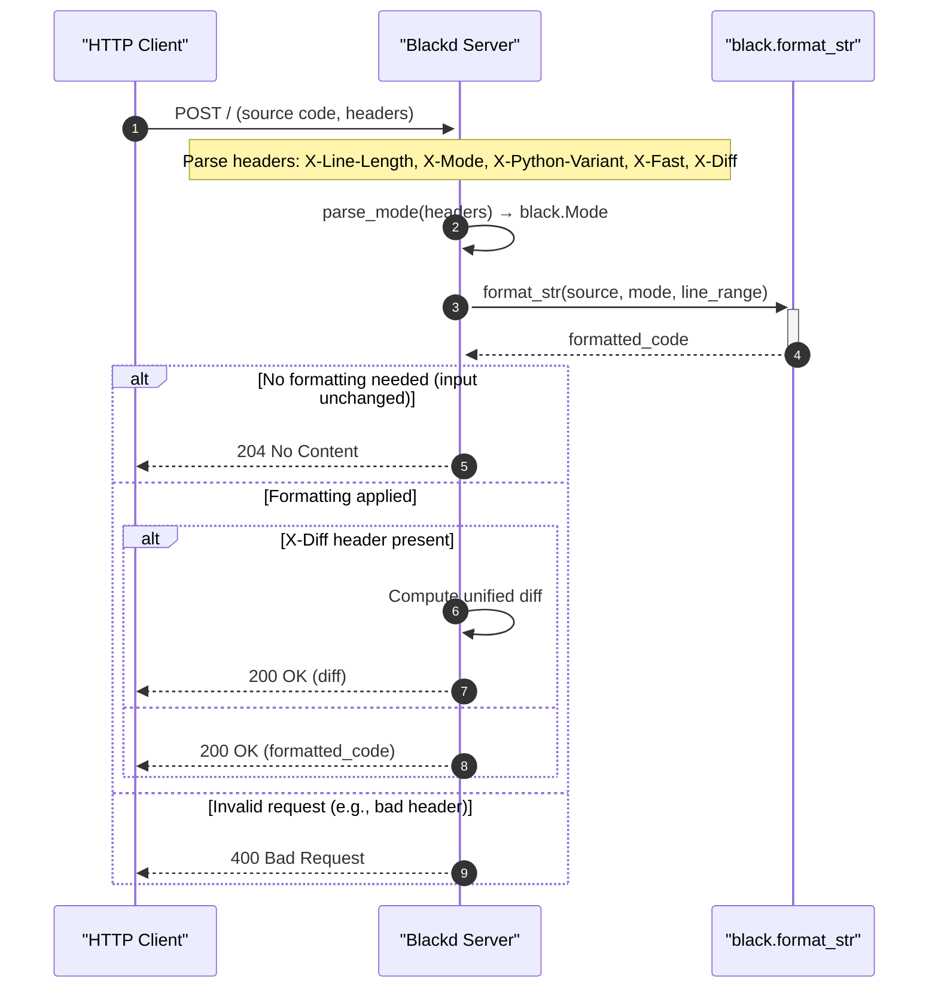
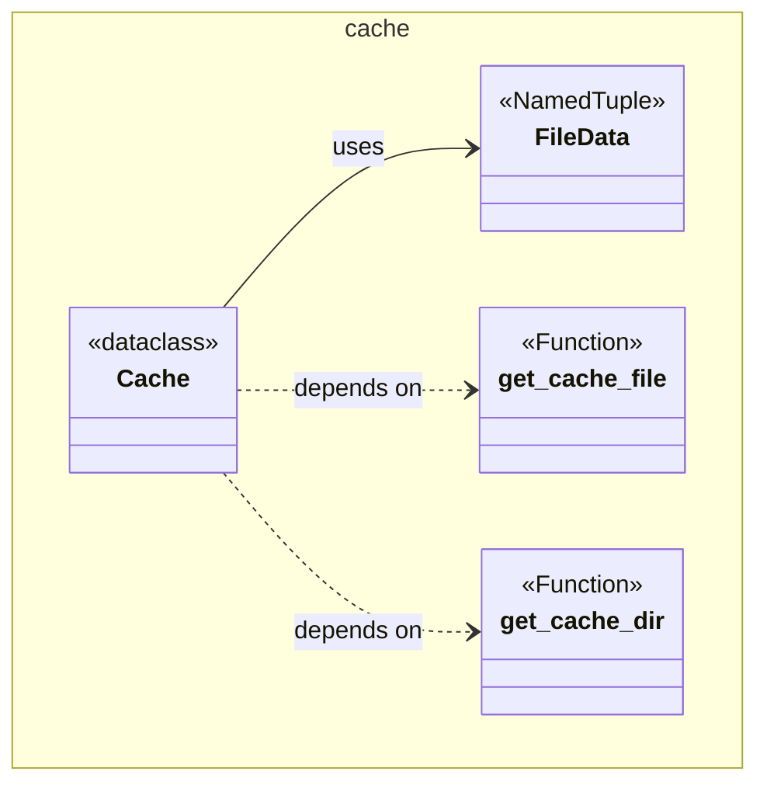
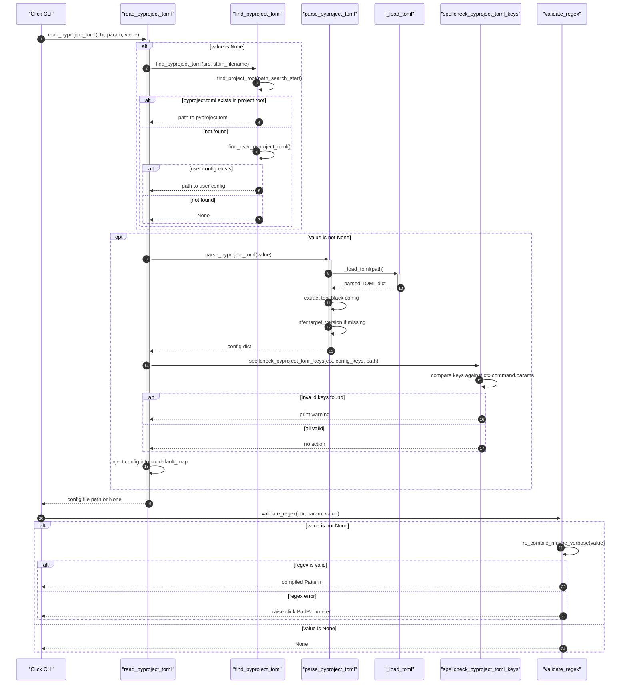

#Black

The uncompromising Python code formatter.


Black is a deterministic, opinionated Python code formatter that frees you from hand-formatting minutiae. By running Black on your code, you get consistent formatting across all projects, smaller diffs in code reviews, and zero time spent arguing about style. It supports Python 3.8+ and works beautifully in editors, CI pipelines, and pre-commit hooks.

[Chat on Discord](https://discord.gg/RtVdv86PrH) · [Documentation](https://black.readthedocs.io/en/stable/) · [Latest Release](https://github.com/psf/black/releases/latest)

> “Any color you like.” — Black is opinionated so you don't have to be.

---

## ✨ Features

- **Deterministic formatting** — Black always produces the same output for the same input, no configuration debates needed
- **Fast and stable** — Reformats files in-place with a guaranteed stable output (idempotent)
- **Preview mode** — Opt into the latest formatting styles with `--preview` to see upcoming changes
- **Line-range formatting** — Format only specific line ranges with `--line-ranges`, perfect for partial file formatting
- **Jupyter notebook support** — Formats `.ipynb` files, handling IPython magic commands transparently
- **`fmt: off` / `fmt: on` directives** — Exclude blocks of code from formatting with inline comments
- **CLI and HTTP API** — Use the `black` command-line tool or the `blackd` HTTP server for editor integration
- **GitHub Action** — Ready-to-use action for CI workflows that installs Black automatically
- **pyproject.toml configuration** — Configure Black's options like line length and target versions in your project's config file
- **Caching** — Avoids reformatting unchanged files by caching formatted file signatures

---

## Requirements

- **Python 3.8 or higher** — Black runs on CPython 3.8+
- **pip** (Python package manager) — for installation
- **Git** — recommended for version control integration and pre-commit hooks

## Installation

Install Black from PyPI using pip:

```bash
pip install black
```

To install with Jupyter notebook support:

```bash
pip install "black[jupyter]"
```

To install for development (from source):

```bash
git clone https://github.com/psf/black.git
cd black
pip install -e ".[dev]"
```

To verify the installation:

```bash
black --version
```

## 🚀 Quick Start

Format a single Python file or entire directory in seconds:

```bash
# Format a single file and check the diff
black --diff my_script.py

# Format a file in-place
black my_script.py

# Format an entire directory
black src/

# Check if files are formatted correctly (exit code only)
black --check src/
```

---

## Usage

### Format a single file

```bash
black my_script.py
```

### Format with a custom line length

```bash
black --line-length 100 my_script.py
```

### Preview upcoming formatting styles

```bash
black --preview src/
```

### Exclude specific files or patterns

```bash
black --exclude "/(\.direnv|\.eggs|\.git|\.hg|\.mypy_cache|\.nox|\.tox|\.venv|_build|buck-out|build|dist)/" src/
```

### Use in pre-commit hooks

```yaml
# .pre-commit-config.yaml
repos:
  - repo: https://github.com/psf/black
    rev: 24.3.0
    hooks:
      - id: black
        language_version: python3.12
```

### Format via the blackd HTTP server

```bash
# Start the server
blackd --bind-host 127.0.0.1 --bind-port 45484

# Send code to format (example with curl)
curl --data 'x=1' http://127.0.0.1:45484
```

### Format specific line ranges

```bash
# Only format lines 10 through 20
black --line-ranges 10-20 my_script.py
```

### Use with IPython/Jupyter notebooks

```bash
black --jupyter notebook.ipynb
```

### Safe mode and stability

By default, Black runs in safe mode, which verifies that the formatted output is AST-equivalent to the original source. Use `--fast` to skip this check for faster formatting:

```bash
black --fast src/
```

---

## Overview

Black is a single-purpose tool: it reformats Python code to conform to a consistent, uncompromising style. The codebase is organized into three main packages under `src/`:

- **`black/`** — The core formatting engine, CLI, configuration, caching, and file handling. This is where the parsing, line generation, bracket tracking, comment normalization, string transformation, and numeric literal formatting logic lives. It also includes a Rust-inspired `Ok`/`Err` result type (`rusty.py`) for structured error handling.
- **`blackd/`** — An aiohttp-based HTTP server that exposes Black's formatting capabilities as a web API, complete with CORS middleware and a Python client for editor integration.
- **`blib2to3/`** — A vendored, modified version of Python's lib2to3 parser and tokenizer, which Black uses to parse source code into syntax trees.

Supporting these are scripts under `scripts/` for release automation (including calendar versioning from git tags), documentation validation, JSON schema generation for configuration, and fuzzing. A GitHub Action lives in `action/` for CI integration, with automatic version detection from git tags or pyproject.toml. The exhaustive test suite lives in `tests/` with hundreds of case files covering edge cases from docstrings and comments to pattern matching and f-strings.

### Architecture Diagram



### Core Formatting Pipeline



### Formatting a Python File Flow



### Blackd Server Request Handling



### Cache Management



### Configuration Loading



---

## 📚 Additional Documentation

For more detailed information, refer to the following resources:

- **Official documentation** – [Read the Docs](https://black.readthedocs.io/en/stable/) provides comprehensive guides, usage examples, and API reference.
- **Source code** – The repository itself contains inline comments and docstrings that explain module purposes, especially in `src/black/`, `src/blackd/`, and `src/blib2to3/`.
- **Contribution guidelines** – See [CONTRIBUTING.md](https://github.com/psf/black/blob/main/CONTRIBUTING.md) for setup, coding standards, and testing practices.
- **Command-line reference** – Run `black --help` or consult the CLI section of the official documentation for all options.