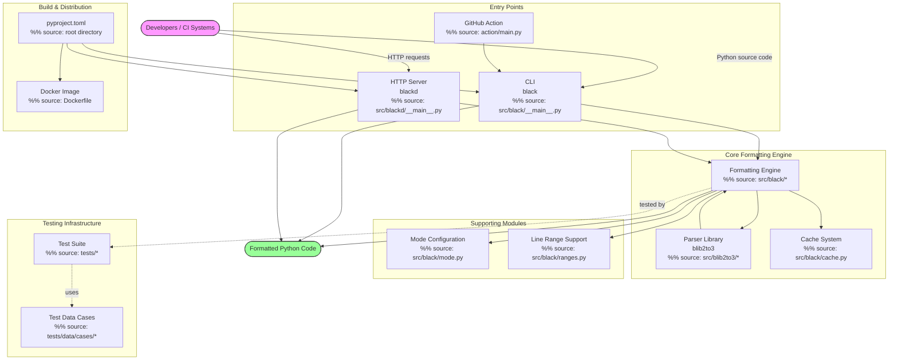

```markdown
# Black Architecture Overview

The uncompromising Python code formatter — system-level design and component interactions.

Black is a deterministic, opinionated code formatter for Python. It parses source code into an abstract syntax tree, applies a comprehensive set of formatting rules, and produces consistently styled output with no configuration required. This document describes the architectural design, component responsibilities, and data flow that make Black's formatting pipeline possible.

---

## Architecture

Black's architecture is organized into three primary packages — the formatting engine (`black`), the HTTP daemon (`blackd`), and the parser library (`blib2to3`) — connected by a well-defined data flow that transforms raw Python source into consistently formatted output.



### Core Components

The system is divided into the following major subsystems:

| Subsystem | Package | Responsibility |
|---|---|---|
| **CLI & Orchestration** | `src/black/__init__.py` | Entry point, CLI argument parsing, file discovery, formatting coordination, write-back modes |
| **Parsing** | `src/blib2to3/` | Python source → CST (Concrete Syntax Tree) via NFA/DFA grammar tables |
| **AST Utilities** | `src/black/nodes.py`, `src/black/parsing.py` | Tree visitor pattern, AST validation, node inspection helpers |
| **Line Generation** | `src/black/linegen.py` | CST traversal to produce `Line` objects, statement-level formatting decisions |
| **Line Splitting** | `src/black/lines.py`, `src/black/brackets.py` | Bracket-aware line splitting, empty line tracking, delimiter priority resolution |
| **String Transformation** | `src/black/trans.py`, `src/black/strings.py` | Long string splitting, merging, parenthesization, normalization |
| **Comment Handling** | `src/black/comments.py` | Comment parsing, `# fmt: off/on/skip` directive processing |
| **Caching** | `src/black/cache.py` | Per-file formatting cache with feature-based invalidation |
| **Output** | `src/black/output.py`, `src/black/report.py` | Diff generation, color output, formatting statistics |
| **HTTP Server** | `src/blackd/` | aiohttp-based daemon for remote formatting |
| **Configuration** | `src/black/mode.py`, `src/black/const.py` | Target version enums, formatting mode, feature flags, preview style definitions |

### Formatting Pipeline

The core formatting pipeline flows through four stages:

```
Source Code ──▶ Parsing ──▶ Line Generation ──▶ Line Splitting ──▶ Output
(blib2to3)      (CST)       (Line objects)      (transform_line)   (string)
```

1. **Parsing**: `blib2to3` tokenizes and parses source code into a Concrete Syntax Tree using grammar tables generated from Python's grammar definition. The parser driver (`blib2to3/pgen2/driver.py`) handles tokenization and tree construction.

2. **Line Generation**: The `LineGenerator` class in `linegen.py` visits CST nodes using a visitor pattern, emitting `Line` objects. Each `Line` contains a sequence of `Leaf` and `Interior` nodes plus associated comments.

3. **Line Splitting**: Lines exceeding the target length are split by `transform_line()` in `linegen.py`. Split decisions are guided by `BracketTracker` (bracket depth and delimiter priority), `EmptyLineTracker` (blank line rules), and the string transformers in `trans.py`.

4. **Output**: Formatted lines are concatenated and written back via the configured `WriteBack` mode (in-place, diff, check, or color-diff). The `Report` class tracks statistics.

### Data Flow Diagram

```text
┌──────────────┐     ┌──────────────┐     ┌──────────────────┐
│  CLI / API   │────▶│  File        │────▶│  blib2to3        │
│  (__init__)  │     │  Discovery   │     │  Parser Driver   │
└──────────────┘     │  (files.py)  │     └────────┬─────────┘
                     └──────────────┘              │
                                                   ▼
┌──────────────┐     ┌──────────────┐     ┌──────────────────┐
│  Output /    │◀────│  Line Split  │◀────│  Line Generator  │
│  Report      │     │  (lines.py)  │     │  (linegen.py)    │
└──────────────┘     └──────────────┘     └──────────────────┘
```

### Key Design Decisions

- **Deterministic output**: Black produces the same formatted output regardless of the original formatting. The formatter is idempotent — running it twice yields no additional changes.
- **Grammar-based parsing**: Rather than using Python's `ast` module, Black uses `blib2to3`, a modified lib2to3 parser that preserves comments and formatting details as CST nodes.
- **Preview mode**: Experimental formatting features are gated behind the `Preview` enum in `mode.py`, allowing incremental rollout of new style rules.
- **Line-range formatting**: The `ranges.py` module enables formatting specific line ranges by converting unchanged top-level statements to standalone comments, preserving their original formatting.
- **Rust-style error handling**: `src/black/rusty.py` provides `Ok`/`Err` result types inspired by Rust for clean error propagation in the parsing pipeline.

---

## Project Structure

The repository is organized into the following top-level directories and key files:

```
black/
├── action/                  # GitHub Action for running Black
├── docs/                    # Documentation and architecture diagrams
├── profiling/               # Performance profiling scripts
├── scripts/                 # Development and release automation scripts
├── src/                     # Main source code
│   ├── black/               # Core formatting engine
│   ├── blackd/              # HTTP daemon server
│   └── blib2to3/            # Python parser library
└── tests/                   # Test suite
    └── data/                # Test case files
```

### Key Source Modules

| Module | Purpose |
|---|---|
| `src/black/__init__.py` | Main entry point with Click CLI and formatting orchestration |
| `src/black/mode.py` | Formatting mode configuration (`Mode`, `TargetVersion`, `Preview`) |
| `src/black/linegen.py` | CST traversal and line object generation |
| `src/black/lines.py` | Line representation and splitting logic |
| `src/black/trans.py` | String transformation pipeline |
| `src/black/comments.py` | Comment parsing and directive handling |
| `src/black/parsing.py` | Source code parsing and AST validation |
| `src/black/cache.py` | Per-file formatting cache management |
| `src/black/files.py` | File discovery, gitignore support, and project root detection |
| `src/blackd/__init__.py` | HTTP server implementation using aiohttp |
| `src/blib2to3/pgen2/` | Parser generator with NFA/DFA grammar construction |

### Test Organization

Test files are located in `tests/` with test data organized in `tests/data/cases/`. Each test file covers a specific formatting feature or edge case, named descriptively (e.g., `docstring.py`, `empty_lines.py`, `pattern_matching_simple.py`). The `tests/conftest.py` configures pytest with custom options for syntax tree debugging.

### Development Scripts

| Script | Purpose |
|---|---|
| `scripts/release.py` | Release automation with git tag management |
| `scripts/diff_shades_gha_helper.py` | CI integration for diff-shades analysis |
| `scripts/fuzz.py` | Property-based testing using Hypothesis |
| `scripts/generate_schema.py` | JSON schema generation for configuration |
| `scripts/migrate-black.py` | Branch migration for formatting changes |
```