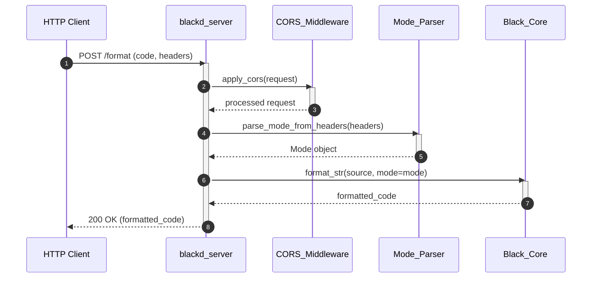

# Blackd HTTP Server Guide

**A HTTP server interface for the Black code formatter.**

Blackd exposes Black's code formatting capabilities over HTTP, enabling remote and programmatic formatting through a REST-like API. Built on aiohttp, it provides an asynchronous server that accepts Python source code and returns formatted output, making it suitable for integration into editor plugins, CI pipelines, and distributed tooling.

## Architecture

Blackd is a lightweight HTTP wrapper around Black's core formatting engine. It consists of four components within the `src/blackd/` package:

| Component | File | Responsibility |
|-----------|------|----------------|
| Server | `__init__.py` | HTTP request handling, header parsing, mode configuration, and format dispatch |
| Entry point | `__main__.py` | Starts the server via `patched_main()` |
| Client | `client.py` | `BlackDClient` class and default header constants for programmatic client access |
| CORS Middleware | `middlewares.py` | Factory function returning an aiohttp CORS middleware for cross-origin requests |

```
┌──────────────┐       HTTP        ┌──────────────┐      format       ┌──────────────┐
│    Client    │ ─────────────────▶ │   blackd     │ ────────────────▶ │  Black Core  │
│  (or remote) │   POST /format    │  (aiohttp)   │   format_str()   │  (formatter) │
└──────────────┘                   └──────────────┘                   └──────────────┘
                                         │
                                    ┌────┴────┐
                                    │  CORS   │
                                    │Middleware│
                                    └─────────┘
```



The server parses formatting options from HTTP headers (such as target Python version and line length) and translates them into a Black `Mode` configuration. Custom exceptions — `HeaderError` and `InvalidVariantHeader` — handle malformed or unsupported header values.

For broader context on how blackd fits into the overall system, see the [Black Architecture Overview](ARCHITECTURE.md).

## Usage

### Starting the Server

Run blackd as a module:

```bash
python -m blackd
```

This calls `blackd.patched_main()`, which starts an aiohttp server listening on a default port.

### Formatting Code via HTTP

Send a POST request with Python source code in the body to format it:

```bash
curl -X POST http://localhost:8080 --data-binary @myscript.py
```

The response body contains the formatted Python code.

### Using the Python Client

The `src/blackd/client.py` module provides a `BlackDClient` class for programmatic access:

```python
from blackd.client import BlackDClient

async with BlackDClient() as client:
    formatted = await client.format_code(source_code)
```

### Controlling Formatting via Headers

Blackd reads formatting configuration from HTTP request headers. Headers correspond to Black's formatting mode options (e.g., target version, line length). Invalid header values raise `InvalidVariantHeader` exceptions.

## Configuration

Blackd inherits Black's formatting options, configurable through HTTP request headers on a per-request basis.

| Header | Description | Default |
|--------|-------------|---------|
| Target version | Python version to target (e.g., `py39`, `py310`) | Black's default target versions |
| Line length | Maximum line length | Black's default (88) |
| Other mode headers | Additional formatting options exposed via headers | Black defaults |

The server itself can be configured through its command-line options (exposed via Click). Consult the command help for available flags:

```bash
python -m blackd --help
```

## Development

### Setup

Blackd is part of the Black monorepo. Install in development mode:

```bash
pip install -e ".[d]"
```

The `[d]` extra installs `aiohttp` and other dependencies required by blackd.

### Key Files

- `src/blackd/__init__.py` — Server logic, header parsing, format handling
- `src/blackd/__main__.py` — Entry point calling `patched_main()`
- `src/blackd/client.py` — Client class and default headers
- `src/blackd/middlewares.py` — CORS middleware factory

### Running Tests

```bash
python -m pytest tests/
```