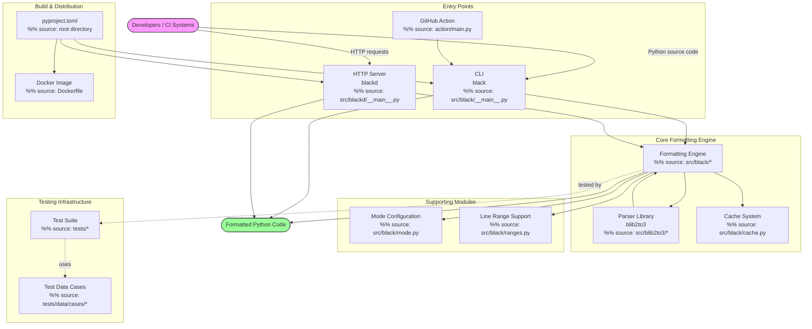
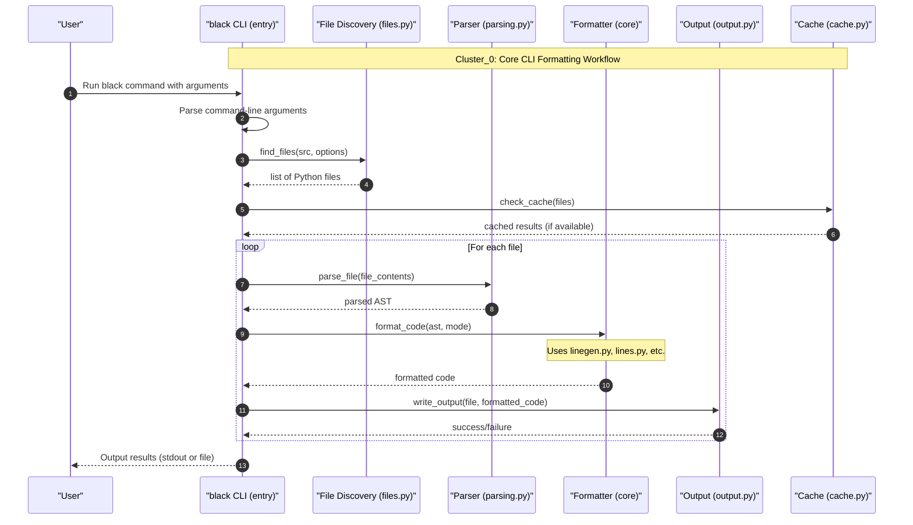

# Core Formatting Engine Guide

The heart of Black's code transformation pipeline — parsing, line generation, splitting, and string rewriting.

The core formatting engine is responsible for taking Python source code and producing consistently formatted output. It encompasses the main entry point, the AST visitor-based line generator, bracket-aware line splitting, string transformation, and comment handling. This guide covers the key modules that participate in the formatting pipeline and how they interact.

## Architecture

The formatting engine follows a pipeline architecture where source code passes through sequential stages: parsing, line generation, line transformation, and output. Each stage operates on progressively more refined representations of the code.

```
┌──────────────┐    ┌──────────────┐    ┌──────────────┐    ┌──────────────┐
│    Source     │───▶│    Parse     │───▶│    Line      │───▶│   Transform  │
│   (str)      │    │  (blib2to3)  │    │  Generator   │    │   Lines      │
└──────────────┘    └──────────────┘    └──────────────┘    └──────────────┘
                                                              │
                                          ┌──────────────┐    │    ┌──────────────┐
                                          │   Output     │◀───┘───▶│   String     │
                                          │  (str)       │         │ Transformers │
                                          └──────────────┘         └──────────────┘
```

### Key Components

| Module | Responsibility |
|--------|---------------|
| `src/black/__init__.py` | Public API (`format_str`, `format_file_contents`) and CLI entry point; orchestrates the full pipeline |
| `src/black/linegen.py` | `LineGenerator` — AST visitor that produces `Line` objects with indentation, comments, and formatting rules |
| `src/black/lines.py` | `Line` representation, `EmptyLineTracker`, and splitting logic (bracket-based, delimiter-based) |
| `src/black/trans.py` | String transformers — merging, splitting, wrapping, and parenthesizing long strings |
| `src/black/brackets.py` | `BracketTracker` — tracks bracket depth and delimiter priority to determine split points |
| `src/black/comments.py` | Comment parsing, normalization, and `# fmt: off/on/skip` directive handling |
| `src/black/nodes.py` | AST node utilities and the `Visitor` base class for lib2to3 tree traversal |
| `src/black/mode.py` | `Mode`, `TargetVersion`, `Preview`, and `Feature` enumerations controlling formatting behavior |
| `src/black/strings.py` | String normalization, Unicode width calculation, and docstring handling |
| `src/black/numerics.py` | Numeric literal reformatting (hex, octal, scientific notation) |
| `src/black/ranges.py` | Line-range formatting — restricts formatting to specified line subsets |

### Data Flow

1. **Parsing** — Source code is parsed via `blib2to3` into a concrete syntax tree (CST).
2. **Line Generation** — `LineGenerator` visits each AST node, producing `Line` objects that contain formatted leaf nodes and comments.
3. **Line Transformation** — Each `Line` is evaluated against the target line length. Lines that exceed the limit are split using bracket-aware, delimiter-aware, and string-aware strategies.
4. **String Rewriting** — Long strings are merged, split, or wrapped in parentheses by the transformer pipeline in `trans.py`.
5. **Empty Line Tracking** — `EmptyLineTracker` in `lines.py` manages blank lines between statements, decorators, and blocks based on formatting mode.
6. **Output** — Transformed lines are concatenated back into a formatted source string.



```mermaid
classDiagram
    direction TB
    
    namespace Core {
        class Parser {
            <<Service>>
            +parse(source_code: str) : AST
            +generate_tokens() : List[Token]
        }
        
        class AST {
            <<Interface>>
            +root: Node
        }
    }
    
    namespace AST {
        class Node {
            <<Abstract>>
            +value: str
            +children: List[Node]
        }
        
        class InteriorNode {
            +children: List[Node]
        }
        
        class LeafNode {
            +value: str
            +type: TokenType
        }
    }
    
    namespace LineGeneration {
        class LineGenerator {
            <<Service>>
            +generate_lines(ast: AST) : List[Line]
            +transform_line(line: Line) : Line
        }
    }
    
    namespace Formatting {
        class Line {
            +depth: int
            +content: str
            +is_comment: bool
            +is_def: bool
            +bracket_tracker: BracketTracker
            +comments: List[str]
        }
        
        class EmptyLineTracker {
            <<Service>>
            +maybe_empty_lines(current_line: Line, previous_line: Line) : List[Line]
        }
        
        class BracketTracker {
            +bracket_depth: int
            +bracket_tally: Dict[str, int]
        }
        
        class TransformLine {
            <<Function>>
            +transform_line(line: Line, mode: Mode) : Line
        }
        
        class DelimiterSplit {
            <<Function>>
            +delimiter_split(line: Line, delimiter: str) : List[Line]
        }
    }
    
    namespace Transformers {
        class StringTransformer {
            <<Interface>>
            +transform(line: Line) : Line
            +do_match(line: Line) : bool
        }
        
        class StringSplitter {
            +transform(line: Line) : Line
            +do_match(line: Line) : bool
        }
        
        class StringMerger {
            +transform(line: Line) : Line
            +do_match(line: Line) : bool
        }
    }
    
    %% Relationships
    Parser --> AST : produces
    AST --> Node : contains root
    Node <|-- InteriorNode : inherits
    Node <|-- LeafNode : inherits
    
    LineGenerator --> Parser : uses
    LineGenerator --> Line : generates
    LineGenerator --> EmptyLineTracker : uses
    
    TransformLine --> LineGenerator : called_by
    TransformLine --> StringTransformer : uses
    TransformLine --> DelimiterSplit : calls
    
    StringTransformer <|-- StringSplitter : inherits
    StringTransformer <|-- StringMerger : inherits
    
    Line --> BracketTracker : has
    Line --> Node : contains
    
    %% Styling for clarity
    classDef service fill:#f9f,stroke:#333,stroke-width:2px
    classDef data fill:#ffd,stroke:#333,stroke-width:2px
    classDef function fill:#dfd,stroke:#333,stroke-width:2px
    classDef interface fill:#dff,stroke:#333,stroke-width:2px
    
    class Parser,LineGenerator,EmptyLineTracker service
    class Line,BracketTracker,AST data
    class TransformLine,DelimiterSplit function
    class Node,StringTransformer interface
```



## Project Structure

The core formatting engine modules reside under `src/black/`. The following tree shows the relevant files:

```
src/black/
├── __init__.py          # Public API and CLI; format_str(), format_file_contents()
├── __main__.py          # Entry point (calls patched_main)
├── mode.py              # Mode, TargetVersion, Preview, Feature definitions
├── nodes.py             # AST node utilities, Visitor base class
├── linegen.py           # LineGenerator — AST visitor producing Line objects
├── lines.py             # Line, EmptyLineTracker, splitting helpers
├── brackets.py          # BracketTracker, BracketMatchError
├── comments.py          # ProtoComment, comment normalization, fmt directives
├── trans.py             # StringTransformer hierarchy, CustomSplit
├── strings.py           # String normalization, width, docstring utils
├── numerics.py          # Numeric literal formatting
├── ranges.py            # Line-range formatting support
├── parsing.py           # lib2to3/AST parsing, ASTSafetyError
├── cache.py             # File caching (Cache, FileData)
├── report.py            # Report, Changed, NothingChanged
├── output.py            # Diff generation, styled output
├── files.py             # File discovery, project root, gitignore
├── concurrency.py       # Multiprocessing formatter
├── const.py             # Default constants
├── debug.py             # DebugVisitor for AST inspection
├── rusty.py             # Rust-style Ok/Err result types
├── schema.py            # JSON schema loader
├── _width_table.py      # Unicode width table
├── handle_ipynb_magics.py  # Jupyter magic masking
└── resources/
    └── __init__.py
```

The `blib2to3` package (`src/blib2to3/`) provides the parser and grammar infrastructure that feeds into the formatting engine. See the [Parser & Grammar Library documentation](PARSER_LIBRARY.md) for details on parsing internals.

## Development

### Environment Setup

```bash
# Create and activate a virtual environment
python -m venv venv
source venv/bin/activate

# Install Black in development mode with all extras
pip install -e ".[d,colorama,jupyter]"
```

### Running Tests

The test suite uses `pytest` with test data files located in `tests/data/cases/`. Each `.py` file in that directory is a formatting test case — Black formats the file and compares against the expected output embedded in the same file.

```bash
# Run the full test suite
pytest tests/

# Run a specific test case
pytest tests/ -k "test_docstring"

# Run with syntax tree output for debugging
pytest tests/ --parse-now --parse-with-lib2to3
```

The `tests/conftest.py` file configures custom pytest options for syntax tree printing, useful when debugging formatting issues.

### Key Formatting Modules to Explore

- **`linegen.py`** — Start here to understand how AST nodes become formatted lines. The `LineGenerator` class has specialized `visit_*` methods for each Python statement type.
- **`lines.py`** — Understand how `Line` objects track leaves, depth, and comments, and how `EmptyLineTracker` manages vertical whitespace.
- **`trans.py`** — Study the string transformer pipeline (`StringMerger`, `StringSplitter`, `StringParenWrapper`) for long string handling.
- **`brackets.py`** — Review `BracketTracker` to understand how Black determines optimal line split points.

### Debugging Formatted Output

The `DebugVisitor` class in `src/black/debug.py` can render the lib2to3 AST structure, which is useful for understanding how Black interprets source code:

```python
from black.debug import DebugVisitor

# Print the AST for a code snippet
DebugVisitor.show AST_for_your_code
```