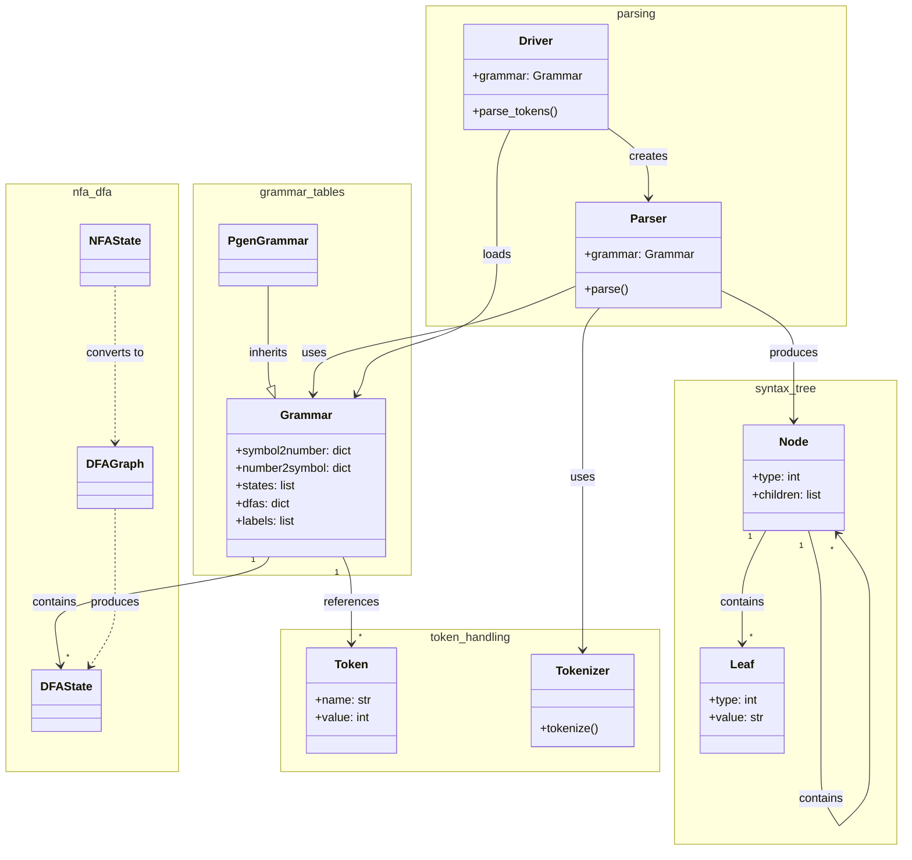
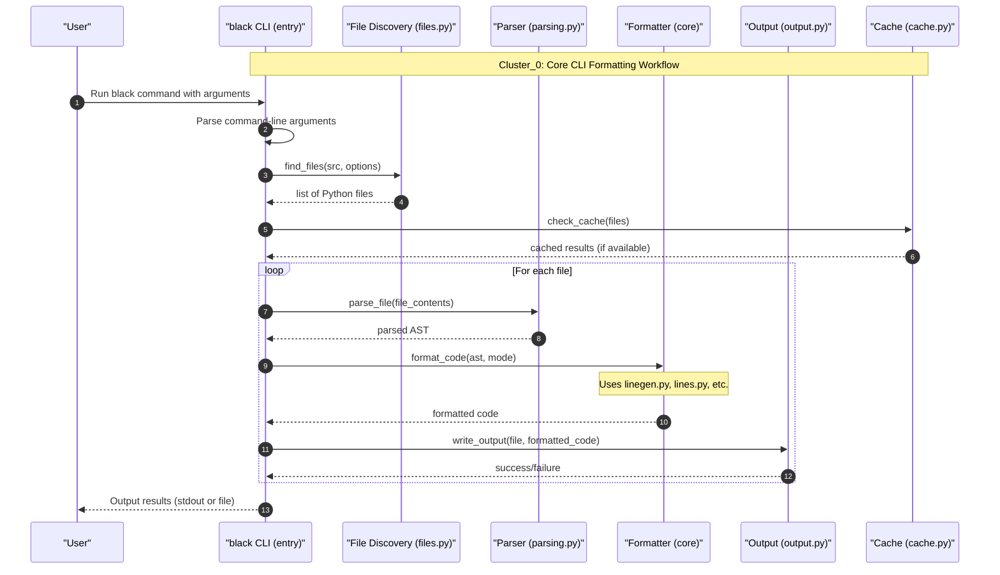

# Parser & Grammar Library (blib2to3)

Blazing Parser for Python — a forked lib2to3 parser and grammar generator that powers Black's source code analysis.

The `blib2to3` package is Black's internal parsing engine, derived from Python's `lib2to3` library. It converts Python source code into a concrete syntax tree (CST) that Black's formatting pipeline consumes. The library provides its own grammar-driven parser generator, tokenizer, and tree representation — all purpose-built to handle the full range of Python syntax while supporting Black's formatting directives like `# fmt: off` and `# fmt: skip`.

## Architecture

The blib2to3 library is organized into two layers: a top-level package providing the tree representation and grammar configuration, and a `pgen2` sub-package implementing the parser generator, tokenizer, and driver.

```text
┌──────────────────────────────────────────────────────┐
│                   Black Core                         │
│           (parsing.py, linegen.py, nodes.py)         │
└──────────────────────┬───────────────────────────────┘
                       │ imports
┌──────────────────────▼───────────────────────────────┐
│                  blib2to3                            │
│                                                      │
│  ┌────────────┐  ┌────────────┐                      │
│  │  pytree.py │  │ pygram.py  │  Tree + Grammar      │
│  └─────┬──────┘  └─────┬──────┘  Definitions         │
│        │               │                             │
│  ┌─────▼───────────────▼──────┐                      │
│  │         pgen2/              │                      │
│  │  ┌─────────┐ ┌───────────┐ │                      │
│  │  │ pgen.py │ │ grammar.py│ │  Parser Generator    │
│  │  └────┬────┘ └─────┬─────┘ │  + Grammar Tables    │
│  │       │            │       │                      │
│  │  ┌────▼────────────▼─────┐ │                      │
│  │  │    driver.py          │ │  Parsing Driver      │
│  │  └──────────┬────────────┘ │                      │
│  │             │              │                      │
│  │  ┌──────────▼────┐ ┌──────▼───────┐              │
│  │  │  parse.py     │ │ tokenize.py  │ Tokenizer     │
│  │  └───────────────┘ └──────────────┘               │
│  │                                                    │
│  │  ┌──────────┐  ┌──────────┐  ┌──────────┐        │
│  │  │ conv.py  │  │token.py  │  │literals.py│       │
│  │  └──────────┘  └──────────┘  └──────────┘        │
│  └──────────────────────────────────────────────────┘
└──────────────────────────────────────────────────────┘
```



### Component Responsibilities

| Component | File | Purpose |
|---|---|---|
| **Tree nodes** | `pytree.py` | Defines interior and leaf node classes representing the concrete syntax tree |
| **Grammar config** | `pygram.py` | Loads and configures the Python grammar tables used by the parser |
| **Grammar class** | `pgen2/grammar.py` | Defines the `Grammar` class and operator-to-token mappings for parser tables |
| **Parser generator** | `pgen2/pgen.py` | Converts grammar specification files into `PgenGrammar` objects via NFA/DFA construction |
| **Converter** | `pgen2/conv.py` | Converts pgen output into Python grammar table format |
| **Driver** | `pgen2/driver.py` | Orchestrates parsing by loading grammars and invoking the parser on source code |
| **Parser** | `pgen2/parse.py` | Core parsing logic that consumes tokens and builds the CST |
| **Tokenizer** | `pgen2/tokenize.py` | Splits Python source into tokens, handling `async`, `await`, f-strings, and whitespace |
| **Token constants** | `pgen2/token.py` | Defines token type constants used throughout the parsing pipeline |
| **Literals** | `pgen2/literals.py` | Safely evaluates Python string literals without using `eval()` |

### Data Flow

The parsing pipeline follows this sequence:

1. **Grammar loading** — `Driver.load_grammar()` reads grammar tables (pre-compiled or generated via `pgen.py`)
2. **Tokenization** — `tokenize.py` splits source code into a token stream
3. **Parsing** — `parse.py` consumes tokens against the grammar to build a CST
4. **Tree construction** — `pytree.py` node classes form the tree structure
5. **Consumption** — Black's `parsing.py` and `linegen.py` traverse the tree for formatting



## Structure

```
src/blib2to3/
├── __init__.py              # Package initializer (empty)
├── pygram.py                # Python grammar configuration and loading
├── pytree.py                # CST node classes (interior and leaf nodes)
└── pgen2/                   # Parser generator sub-package
    ├── __init__.py          # Package initializer
    ├── grammar.py           # Grammar class, operator-to-token mapping
    ├── pgen.py              # NFA/DFA parser generator from grammar files
    ├── conv.py              # Converter: pgen output → grammar tables
    ├── driver.py            # Parsing driver: grammar loading + parse orchestration
    ├── parse.py             # Core parser consuming token streams
    ├── tokenize.py          # Python tokenizer (async, await, f-strings, whitespace)
    ├── token.py             # Token type constants
    └── literals.py          # Safe string literal evaluation
```

Key relationships to other Black modules:

- **`src/black/parsing.py`** — Primary consumer; calls into blib2to3 to parse source code and validates AST equivalence
- **`src/black/nodes.py`** — Provides the `Visitor` base class for traversing the CST produced by blib2to3
- **`src/black/debug.py`** — `DebugVisitor` class inspects and prints blib2to3 tree structure
- **`src/black/__init__.py`** — Imports blib2to3 as part of the main formatting pipeline

## Development

### Setup

blib2to3 is part of the Black source tree and does not require separate installation. When developing Black:

```bash
# Install Black in editable mode
pip install -e ".[d]"

# Verify parsing works
python -c "from blib2to3.pygram import python_grammar; print('Grammar loaded successfully')"
```

### Testing

blib2to3 is exercised extensively by Black's test suite. The test cases under `tests/data/cases/` provide input/output pairs that exercise the parser across many Python syntax patterns:

```bash
# Run the full test suite
python -m pytest tests/

# Run tests specific to parsing
python -m pytest tests/ -k "parse"
```

Test data files covering parser-relevant scenarios include `tests/data/cases/` with files for annotations, async statements, pattern matching, f-strings, and other syntax features that validate blib2to3's parsing correctness.

### Grammar Modification

The grammar tables are generated and loaded at runtime. To modify the grammar:

1. Edit the grammar specification used by `pgen2/pgen.py`
2. Regenerate grammar tables using the pgen2 generator
3. The `pgen2/conv.py` converter transforms pgen output into the final table format
4. `pgen2/driver.py` loads the resulting tables at runtime