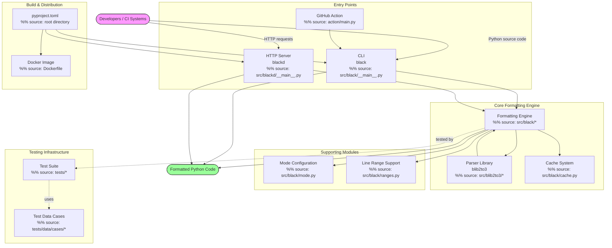
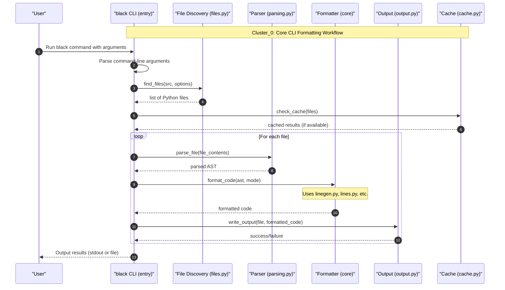

# Testing Guide for Black

Comprehensive guide to Black's test suite, test infrastructure, and testing practices.

Black maintains an extensive test suite to ensure formatting correctness, stability, and idempotency across diverse Python code patterns. This guide covers test structure, conventions, execution, and how to write effective tests for the formatter.





## Overview

Black's test infrastructure is built around **snapshot-based formatting tests** — each test case consists of an input Python file (often containing both unformatted and expected formatted output) that Black processes and asserts against. The test suite covers formatting rules, edge cases, preview features, and regression scenarios.

Key characteristics of the test suite:

- **Snapshot-driven**: Test cases in `tests/data/cases/` contain both input and expected output
- **Mode-parameterized**: Many tests run across multiple formatting modes (target versions, preview features, line lengths)
- **Comprehensive coverage**: Over 100 test case files covering docstrings, comments, empty lines, string splitting, generics, pattern matching, and more
- **Property-based fuzzing**: Hypothesis-based fuzz tests verify formatting idempotency

## Project Context

- **Project Name**: Black

## Testing

### Running Tests

The test suite uses **pytest** as its test runner. Basic execution:

```bash
# Run all tests
pytest

# Run with verbose output
pytest -v

# Run a specific test file
pytest tests/test_format.py

# Run a specific test by name
pytest -k "test_docstring"
```

### Pytest Configuration

The pytest configuration is defined in `tests/conftest.py`. This file configures custom command-line flags and global settings for test execution. Notable configuration includes:

- Custom options for syntax tree printing (debugging AST output)
- Global settings based on parsed flags
- Plugin setup for formatting assertions

### Test Structure

```
tests/
├── __init__.py
├── conftest.py          # Pytest configuration and custom options
└── data/
    ├── cases/           # Snapshot test cases for formatting rules
    ├── gitignore_used_on_multiple_sources/
    ├── include_exclude_tests/
    ├── invalid_gitignore_tests/
    ├── line_ranges_formatted/
    ├── miscellaneous/
    ├── nested_gitignore_tests/
    └── ignore_*         # Various file discovery test fixtures
```

### Test Case Convention

Test case files in `tests/data/cases/` follow a consistent pattern:

- Each `.py` file contains **input code** that Black processes
- The expected formatted output is embedded within the same file (separated by markers) or verified via idempotency assertions
- Test files are named descriptively to indicate the feature being tested

Example test case categories:

| File Pattern | Purpose |
|---|---|
| `docstring*.py` | Docstring formatting rules |
| `comments*.py` | Comment placement and formatting |
| `empty_lines.py` | Blank line insertion/removal rules |
| `fmtskip*.py` | `# fmt: skip` directive handling |
| `fmtonoff*.py` | `# fmt: off` / `# fmt: on` directives |
| `pep_*.py` | PEP-specific formatting rules |
| `pattern_matching_*.py` | Match/case statement formatting |
| `generics_wrapping.py` | Type parameter wrapping |
| `long_strings*.py` | String splitting and merging |
| `line_ranges_*.py` | Selective line-range formatting |

### Writing New Tests

To add a new formatting test case:

1. Create a new `.py` file in `tests/data/cases/` with a descriptive name
2. Include the unformatted input code in the file
3. The existing test framework will assert that Black formats the code to the expected output
4. For preview-only features, prefix the filename with `preview_` (e.g., `preview_long_strings.py`)

### Fuzz Testing

Property-based fuzz tests are available in `scripts/fuzz.py`. These tests use **Hypothesis** and **Hypothesmith** to generate random Python source code and verify that Black's formatting is idempotent — applying Black twice produces the same result.

```bash
# Run fuzz tests
python scripts/fuzz.py
```

### Test Categories

Black's tests cover several distinct areas:

**Core formatting rules** — Tests that verify Black's fundamental formatting decisions:
- Empty line handling (`empty_lines.py`, `allow_empty_first_line.py`)
- Indentation and bracket placement (`bracketmatch.py`, `backslash_before_indent.py`)
- Line length enforcement (`linelength6.py`, `cantfit.py`)
- Numeric literal formatting (`numeric_literals.py`)

**Comment handling** — Extensive comment formatting tests:
- Inline and trailing comments (`comments.py` through `comments9.py`)
- Comments in comprehensions (`comments_in_comprehensions.py`)
- Comments in blocks and double parens (`comments_in_blocks.py`, `comments_in_double_parens.py`)
- Type hint comments (`comment_type_hint.py`)

**Formatting directives** — Tests for manual formatting control:
- `# fmt: skip` (`fmtskip.py` through `fmtskip13.py`, plus specialized variants)
- `# fmt: off` / `# fmt: on` (`fmtonoff.py` through `fmtonoff6.py`)

**String handling** — Tests for string transformation logic:
- Long string splitting (`long_strings__type_annotations.py`, `long_strings_flag_disabled.py`)
- Docstring formatting (`docstring.py`, `docstring2.py`, `docstring_tabs.py`, `f_docstring.py`)
- F-strings (`fstring.py`, `fstring_quotations.py`)
- Unicode escape sequences (`format_unicode_escape_seq.py`)

**Python version features** — Tests for version-specific syntax:
- Pattern matching (`pattern_matching_*.py`)
- Context managers (`context_managers_38.py`, `context_managers_39.py`, `context_managers_autodetect_*.py`)
- PEP 572 walrus operator (`pep_572*.py`)
- PEP 604 union types (`pep_604*.py`)
- PEP 654 exception groups (`pep_654*.py`, `pep_654_style.py`)
- PEP 701 f-string improvements (`pep_701.py`)
- PEP 646 type parameter syntax (`pep_646.py`)

**File discovery and line ranges** — Tests for selective formatting:
- Line range formatting (`line_ranges_basic.py`, `line_ranges_indentation.py`, `line_ranges_imports.py`)
- Edge cases (`line_ranges_fmt_off.py`, `line_ranges_fmt_off_decorator.py`)

## Development

### Development Environment Setup

```bash
# Clone and install in development mode
git clone https://github.com/psf/black.git
cd black
python -m venv venv
source venv/bin/activate

# Install with development dependencies (using hatch)
pip install --group hatch

# Build and install the package
hatch build -t wheel
pip install dist/*-cp*
```

### Available Scripts

The `scripts/` directory contains several utility scripts:

| Script | Purpose |
|---|---|
| `scripts/fuzz.py` | Property-based fuzz testing with Hypothesis |
| `scripts/generate_schema.py` | Generate JSON schema from CLI for Black configuration |
| `scripts/make_width_table.py` | Generate Unicode width table |
| `scripts/diff_shades_gha_helper.py` | CI/CD helper for diff-shades analysis |
| `scripts/release.py` | Release automation (versioning, changelog) |
| `scripts/release_tests.py` | Tests for the release process |
| `scripts/migrate-black.py` | Migrate a feature branch to Black formatting |
| `scripts/check_pre_commit_rev_in_example.py` | Verify pre-commit example version |
| `scripts/check_version_in_basics_example.py` | Verify version in documentation |

### Debugging Tools

Black provides a `DebugVisitor` class (in `src/black/debug.py`) for inspecting the lib2to3 AST. This can be useful when debugging formatting issues or writing new test cases.

### Code Formatting

Black is itself formatted by Black. The project maintains consistent code style across the codebase.

### Docker Development

A `Dockerfile` is provided for containerized usage:

```dockerfile
FROM python:3.13-slim
# Black is installed via pip with colorama, d, and uvloop extras
CMD ["/opt/venv/bin/black"]
```

For development testing via Docker:

```bash
docker build -t black-dev .
docker run --rm -v $(pwd):/code black-dev /code/my_file.py
```

## Contributing

Contributions to Black's test suite are welcome. When adding new tests:

1. **Follow naming conventions** — Name test files descriptively after the feature or edge case being tested
2. **Use the snapshot pattern** — Include both input and expected output in the test case file
3. **Cover edge cases** — Test boundary conditions like maximum line length, deeply nested structures, and unusual syntax patterns
4. **Test multiple modes** — Verify behavior across relevant target versions and with/without preview features
5. **Ensure idempotency** — All formatted output must be stable across repeated formatting passes

For general contribution guidelines including code style, PR workflow, and development setup, refer to [Contributing to Black](CONTRIBUTING.md).

For deeper understanding of the formatting engine that these tests exercise, see [Core Formatting Engine Guide](CORE_FORMATTER.md). For understanding the parser that feeds into the formatting pipeline, see [Parser & Grammar Library (blib2to3)](PARSER_LIBRARY.md).